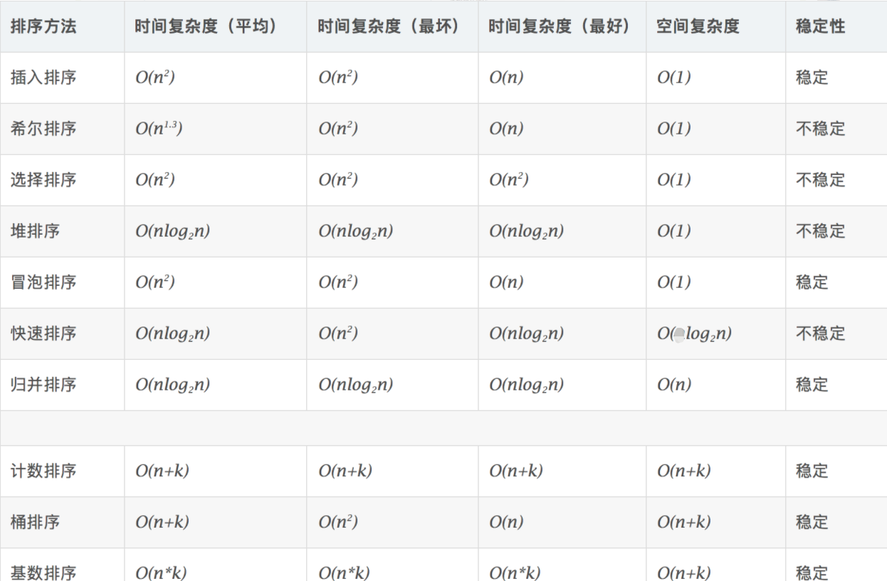
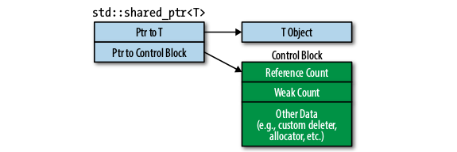
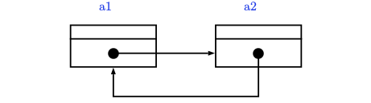

# 语言基础

## C++ cast强制类型转换

四种强制类型转换操作符：static_cast、dynamic_cast、const_cast、reinterpret_cast

### dynamic_cast

dynamic_cast是在运行时检查的，用于在集成体系中进行安全的向下转换downcast(当然也可以向上转换，但没必要，因为可以用虚函数实现)，基类指针/引用 -> 派生类指针/引用，如果源和目标没有继承/被继承关系，编译器会报错！

- dynamic_cast是4个转换中唯一的RTTI操作符，提供运行时类型检查
- dynamic_cast不是强制转换，而是带有某种”咨询“性质的，如果不能转换，返回NULL。这是强制转换做不到的
- 源类中必须要有虚函数，保证多态，才能使用dynamic_cast<source>(expression)
- 只用于对象的指针和引用，主要用于执行“安全的向下转型”，也就是说，要确定一个对象是否是一个继承体系中的一个特定类型。它是唯一不能用旧风格语法执行的强制转型，也是唯一可能有重大运行时代价的强制转型
- 当用于多态类型时（包含虚函数），它允许任意的隐式类型转换以及相反过程。不过，与static_cast不同，在后一种情况里（即隐式转换的相反过程），dynamic_cast根据RTTI信息检查操作是否有效。即在转换时dynamic_cast会检查转换是否能返回一个被请求的有效的完整对象。这种检查不是语法上的，而是真实情况的检查。检测在运行时进行，如果被转换的指针不是一个被请求的有效完整的对象指针，返回值为NULL。先看RTTI相关部分，通常，许多编译器都是通过vtable找到对象的RTTI信息的，这也就意味着，如果基类没有虚函数，也就无法判断一个基类指针变量所指对象的真实类型, 这时候dynamic_cast只能用来做安全的转换（upercasting），如从派生类指针转换成基类指针，而这种转换其实并不需要dynamic_cast参与

### static_cast

static_cast < type-id > ( expression )，该运算符把expression转换为type-id类型，但没有运行时类型检查来保证转换的安全性。它允许执行任意的隐式转换和相反转换动作

- 用于基本数据类型之间的转换，如把int转换成char，non-const 对象转型为 const 对象（这里相反方向不可以，C++只有const_cast可以）
- 把空指针转换成目标类型的指针。（之前的做法是用强制转换(type-id*)）
- 把任何类型的表达式转换成void类型
- 应用到类的指针上，它允许子类类型的指针转换为父类类型的指针（upercasting这是一个有效的隐式转换）；也能够执行相反动作，即转换父类为它的子类（downcasting），这种转换的安全性需要开发人员来保证（主要是在非上下转型中）
- 注意static_cast不能转换掉expression的const、volitale、或者__unaligned属性。在非基本类型或上下转型中，被转换的父类需要检查是否与目的类型相一致，否则，如果在两个完全不相干的类之间进行转换，将会导致编译出错

### reinterpret_cast

reinpreter_cast<type-id> (expression) type-id必须是一个指针、引用、算术类型、函数指针或者成员指针。它可以把一个指针转换成一个整数，也可以把一个整数转换成一个指针

- 这个操作符能够在非相关的类型之间转换。操作结果只是简单的从一个指针到别的指针的值的二进制拷贝。在类型之间指向的内容不做任何类型的检查和转换。reinpreter_cast是特意用于底层的强制转型，导致实现依赖（就是说，不可移植）的结果
- 仅仅是复制n1的比特位到d_r, 没有进行必要的分析.interpret_cast是为了映射到一个完全不同类型的意思，这个关键词在我们需要把类型映射回原有类型时用到它。我们映射到的类型仅仅是为了故弄玄虚和其他目的，这是所有映射中最危险的

### const_cast

const_cast<type_id> (expression) 用于修改类型的const或volatile属性。除了const 或volatile修饰之外，type_id和expression的类型是一样的，一般用于强制消除对象的常量性。它是唯一能做到这一点的 C++ 风格的强制转型，而C不提供消除const的机制

- 常量指针被转化成非常量指针，并且仍然指向原来的对象；常量引用被转换成非常量引用，并且仍然指向原来的对象；常量对象被转换成非常量对象

### static_cast与dynamic_cast比较

前者提供的是编译时期的静态类型检测,后者提供的是运行时检测

- static_cast：1完成基础数据类型，2同一个继承体系中类型的转换，3任意类型与空指针类型void*之间的转换
- dynamic_cast：使用多态的场景，增加了一层对真实调用对象类型的检查

## 虚函数

### 虚函数

   C++中的虚函数的作用主要是实现了多态的机制。关于多态，简而言之就是用父类型的指针指向其子类的实例，然后通过父类的指针调用实际子类的成员函数。这种技术可以让父类的指针有“多种形态”，这是一种泛型技术(所谓泛型技术，说白了就是试图使用不变的代码来实现可变的算法。比如：模板技术，RTTI技术，虚函数技术，要么是试图做到在编译时决议，要么试图做到运行时决议)

   如果调用非虚函数，则无论实际对象是什么类型，都执行基类类型所定义的函数。非虚函数总是在编译时根据调用该函数的对象，引用或指针的类型而确定。如果调用虚函数，则直到运行时才能确定调用哪个函数，运行的虚函数是引用所绑定或指针所指向的对象所属类型定义的版本

   虚函数必须是基类的非静态成员函数。虚函数的作用是实现动态联编，也就是在程序的运行阶段动态地选择合适的成员函数，在定义了虚函数后，可以在基类的派生类中对虚函数重新定义，在派生类中重新定义的函数应与虚函数具有相同的形参个数和形参类型。以实现统一的接口，不同定义过程。如果在派生类中没有对虚函数重新定义，则它继承其基类的虚函数

### 纯虚函数

   纯虚函数是在基类中声明的虚函数，它在基类中没有定义，但要求任何派生类都要定义自己的实现方法。在基类中实现纯虚函数的方法是在函数原型后加“=0”

   在很多情况下，基类本身生成对象是不合情理的。例如，动物作为一个基类可以派生出老虎、孔雀等子类，但动物本身生成对象明显不合常理。为了解决上述问题，将函数定义为纯虚函数，则编译器要求在派生类中必须予以重写以实现多态性。同时含有纯虚拟函数的类称为抽象类，它不能生成对象。这样就很好地解决了上述两个问题。将函数定义为纯虚函数能够说明，该函数为后代类型提供了可以覆盖的接口，但是这个类中的函数绝不会调用

   声明了纯虚函数的类是一个抽象类。所以，用户不能创建类的实例，只能创建它的派生类的实例。必须在继承类中重新声明函数（不要后面的＝0）否则该派生类也不能实例化，而且它们在抽象类中往往没有定义

   定义纯虚函数的目的在于，使派生类仅仅只是继承函数的接口。纯虚函数的意义，让所有的类对象（主要是派生类对象）都可以执行纯虚函数的动作，但类无法为纯虚函数提供一个合理的缺省实现。所以类纯虚函数的声明就是在告诉子类的设计者，“你必须提供一个纯虚函数的实现，但我不知道你会怎样实现它”

### 抽象类

   称带有纯虚函数的类为抽象类，抽象类是一种特殊的类，它是为了抽象和设计的目的为建立的，它处于继承层次结构的较上层。抽象类的主要作用是将有关的操作作为结果接口组织在一个继承层次结构中，由它来为派生类提供一个公共的根，派生类将具体实现在其基类中作为接口的操作。所以派生类实际上刻画了一组子类的操作接口的通用语义，这些语义也传给子类，子类可以具体实现这些语义，也可以再将这些语义传给自己的子类

   使用抽象类时注意，抽象类只能作为基类来使用，其纯虚函数的实现由派生类给出。如果派生类中没有重新定义纯虚函数，而只是继承基类的纯虚函数，则这个派生类仍然还是一个抽象类。如果派生类中给出了基类纯虚函数的实现，则该派生类就不再是抽象类了，它是一个可以建立对象的具体的类。抽象类是不能定义对象的

## 构造与析构函数

### 虚函数在构造函数中的作用

***构造函数为什么不能为虚函数？***

- 构造一个对象的时候，必须知道对象的实际类型，而虚函数行为是在运行期间确定实际类型的。而在构造一个对象时，由于对象还未构造成功。编译器无法知道对象 的实际类型，是该类本身，还是该类的一个派生类，或是更深层次的派生类
- 虚函数的执行依赖于[虚函数表](https://www.baidu.com/s?wd=虚函数表&tn=SE_PcZhidaonwhc_ngpagmjz&rsv_dl=gh_pc_zhidao)。而[虚函数表](https://www.baidu.com/s?wd=虚函数表&tn=SE_PcZhidaonwhc_ngpagmjz&rsv_dl=gh_pc_zhidao)在构造函数中进行初始化工作，即初始化vptr，让他指向正确的[虚函数表](https://www.baidu.com/s?wd=虚函数表&tn=SE_PcZhidaonwhc_ngpagmjz&rsv_dl=gh_pc_zhidao)。而在构造对象期间，虚函数表还没有被初 始化，将无法进行。虚函数的意思就是开启动态绑定，程序会根据对象的动态类型来选择要调用的方法。然而在构造函数运行的时候，这个对象的动态类型还不完整，没有办法确定它到底是什么类型，故构造函数不能动态绑定。（动态绑定是根据对象的动态类型而不是函数名，在调用构造函数之前，这个对象根本就不存在，它怎么动态绑定？）编译器在调用基类的构造函数的时候并不知道你要构造的是一个基类的对象还是一个派生类的对象

### 虚函数在析构函数中的作用

在类的继承中，如果有基类指针指向派生类，那么用基类指针delete时，如果不定义成虚函数，派生类中派生的那部分无法析构

### 几个注意事项

***构造函数和析构函数的几个知识点***

- 如果我们定义了一个构造函数，编译器就不会再为我们生成默认构造函数了
- 编译器生成的析构函数是非虚的，除非是一个子类，其父类有个虚析构，此时的函数虚特性来自父类
- 有虚函数的类，几乎可以确定要有个虚析构函数
- 如果一个类不可能是基类就不要申明析构函数为虚函数，虚函数是要耗费空间的
- 析构函数的异常退出会导致析构不完全，从而有内存泄露。最好是提供一个管理类，在管理类中提供一个方法来析构，调用者再根据这个方法的结果决定下一步的操作
- 在构造函数不要调用虚函数。在基类构造的时候，虚函数是非虚，不会走到派生类中，既是采用的静态绑定。显然的是：当我们构造一个子类的对象时，先调用基类的构造函数，构造子类中基类部分，子类还没有构造，还没有初始化，如果在基类的构造中调用虚函数，如果可以的话就是调用一个还没有被初始化的对象，那是很危险的，所以C++中是不可以在构造父类对象部分的时候调用子类的虚函数实现。但是不是说你不可以那么写程序，你这么写，编译器也不会报错。只是你如果这么写的话编译器不会给你调用子类的实现，而是还是调用基类的实现
- 在析构函数中也不要调用虚函数。在析构的时候会首先调用子类的析构函数，析构掉对象中的子类部分，然后在调用基类的析构函数析构基类部分，如果在基类的析构函数里面调用虚函数，会导致其调用已经析构了的子类对象里面的函数，这是非常危险的
- 记得在写派生类的拷贝函数时，调用基类的拷贝函数拷贝基类的部分

## 多态

### 多态类型

- 静态类型：对象声明的类型，是在编译时确定的
- 动态类型：目前所指对象的类型，是在运行时确定的

### 多态概念

- 静态多态（也叫编译时多态性）：函数重载和运算符的重载属于静态多态性，在程序编译时就能决定调用的是哪一个函数，静态多态是通过函数的重载来实现的（运算符重载实际上也属于函数的重载）
- 动态多态（又称运行时多态性）：程序运行过程中才动态地确定操作所针对的对象，运行时多态性是通过虚函数来实现的

## 内联函数和宏定义

### 内联的动机

   引入内联函数的目的是为了解决程序中函数调用的效率问题。函数是一种更高级的抽象。它的引入使得编程者只关心函数的功能和使用方法，而不必关心函数功能的具体实现；函数的引入可以减少程序的目标代码，实现程序代码和数据的共享。但是，函数调用也会带来降低效率的问题，因为调用函数实际上将程序执行顺序转移到函数所存放在内存中某个地址，将函数的程序内容执行完后，再返回到转去执行该函数前的地方。这种转移操作要求在转去前要保护现场并记忆执行的地址，转回后先要恢复现场，并按原来保存地址继续执行。因此，函数调用要有一定的时间和空间方面的开销，于是将影响其效率。特别是对于一些函数体代码不是很大，但又频繁地被调用的函数来讲，解决其效率问题更为重要。引入内联函数实际上就是为了解决这一问题，内联函数在调用时，是将调用表达式用内联函数体来替换

### 内联和宏定义

***宏定义缺点***

- 宏只做简单的字符串替换，函数是参数传递，所以必然有参数类型检查(支持各种类型，而不是只有字符串)
- 宏不经计算而直接替换参数，函数调用则是将参数表达式求值再传递给形参
- 宏在编译前进行，即先替换再编译。而函数是编译后，在执行时才调用的。宏占编译时间，而函数占执行时间
- 宏参数不占空间，因为只做字符串替换，而函数调用时参数传递是变量之间的传递，形参作为局部变量占内存空间
- 函数调用需要保留现场，然后转入调用函数执行，执行完毕再返回主调函数，这些耗费在宏中是没有的

***内联优点***

- 在使用时，宏只做简单的预处理器符号表(字符串)中的简单替换。而内联函数可以进行参数类型检查，且具有返回值(也能被强制转换为可转换的合适类型)
- 内联函数首先是函数，函数的许多性质都适用于内联函数(如内联函数可以重载)
- 内联函数可以作为某个类的成员函数，这样可以使用类的保护成员和私有成员。而当一个表达式涉及到类保护成员或私有成员时，宏就不能实现了(无法将this指针放在合适位置)
- 内联代码的调试信息通常比扩展的宏代码更有用
- 在宏中的编译错误很难发现，因为它们引用的是扩展的代码，而不是程序员键入的

***内联不适宜场景***

- 如果函数体内的代码比较长，使用内联将导致内存消耗代价较高
- 如果函数体内出现循环，那么执行函数体内代码的时间要比函数调用的开销大。类的构造函数和析构函数容易让人误解成使用内联更有效。要当心构造函数和析构函数可能会隐藏一些行为，如“偷偷地”执行了基类或成员对象的构造函数和析构函数。所以不要随便地将构造函数和析构函数的定义体放在类声明中。一个好的编译器将会根据函数的定义体，自动地取消不值得的内联（这进一步说明了 inline 应该出现在函数的声明文件中）
- 编译器比程序设计者更清楚对于一个特定的函数是否合适进行内联扩展；一些情况下，对于程序员指定的某些内联函数，编译器可能更倾向于不使用内联甚至根本无法完成内联
- 对于基于C的编译系统，内联函数的使用可能大大增加编译时间，因为每个调用该函数的地方都需要替换成函数体，代码量的增加也同时带来了潜在的编译时间的增加

### 虚函数是否可以是内联函数

虚函数是通过指针或引用调用函数时，通过虚函数表来确定调用的函数，在运行时确定。内联函数是在编译时，将调用函数处插入内联函数的代码，省去了函数调用时的开销。内联函数从原则上讲不能是虚函数，内联在编译期完成，而虚函数在执行时绑定。当使用非多态调用时，编译器可选择内联，许多时候，派生类的虚函数会调用基类的同名函数，这时候不是多态调用，可以内联。内联函数到底要不要在调用处展开取决于怎么调用内联函数，例如：

```cpp
#include <cstdio>

struct Base {
    virtual ~Base() {}
    virtual void Foo() { printf("Base::Foo()\n"); }
};

struct Derived : Base {
    virtual void Foo() { printf("Derived::Foo()\n"); }
};

Base* b = new Derived; // 非 static 令编译器不能在编译期知道 b 指向那个类型的对像

int main() {
    b->Foo();       // 不可能内联
    b->Base::Foo(); // 非多态调用，可以内联（但具体是否内联由编译器决定）
    delete b;
}
```

内联函数是个静态行为，而虚函数是个动态行为，他们之间是有矛盾的。我们之所以能看到一些象内联函数的虚函数，是因为某个函数是否是内联函数不是由我们说的算，而是由编译器决定的。我们只能向编译器建议，某个函数可以是内联函数(inline关键字)，但是编译器有自己的判断法则。所以可能出现这样的情况

- 我们用inline声明的函数却没有inline
- 我们没有用inline声明的函数却是inline
- 对于inline函数，编译器仍然将它编译成一个有地址的函数

所以，情况比较复杂，从high-level来看的话很难判断函数是否是inline的，如果从low-level来看的话就比较清晰，非内联函数遵从函数调用机制，在汇编中用call来调用。内联函数则没有这些。


## extern关键字

### 作用

- extern可以置于变量或者函数前，以标示变量或者函数的定义在别的文件中，提示编译器遇到此变量和函数时在其他模块中寻找其定义
- extern也可用来进行链接指定

### extern "C"

- 当它与"C"一起连用时，如: extern "C" void fun(int a, int b);则告诉编译器在编译fun这个函数名时按着C的规则去翻译相应的函数名而不是C++的，C++的规则在翻译这个函数名时会把fun这个名字变得面目全非，可能是fun@aBc_int_int#%$也可能是别的，这要看编译器的"脾气"了(不同的编译器采用的方法不一样)，为什么这么做呢，因为C++支持函数的重载
- 当extern不与"C"在一起修饰变量或函数时，如在头文件中: extern int g_Int; 它的作用就是声明函数或全局变量的作用范围的关键字，其声明的函数和变量可以在本模块活其他模块中使用，记住它是一个声明不是定义!也就是说B模块(编译单元)要是引用模块(编译单元)A中定义的全局变量或函数时，它只要包含A模块的头文件即可,在编译阶段，模块B虽然找不到该函数或变量，但它不会报错，它会在连接时从模块A生成的目标代码中找到此函数

## static 关键字

static 关键字作用

- 隐藏：当同时编译多个文件时，所有未加static前缀的全局变量和函数都具有全局可见性，如果加了static，就会对其它源文件隐藏。利用这一特性可以在不同的文件中定义同名函数和同名变量，而不必担心命名冲突

- 保持变量内容的持久：存储在静态数据区的变量会在程序刚开始运行时就完成初始化，也是唯一的一次初始化。共有两种变量存储在静态存储区：全局变量和static变量，只不过和全局变量比起来，static可以控制变量的可见范围，说到底static还是用来隐藏的

- 默认初始化为0：其实全局变量也具备这一属性，因为全局变量也存储在静态数据区。在静态数据区，内存中所有的字节默认值都是0x00，某些时候这一特点可以减少程序员的工作量。比如初始化一个稀疏矩阵，我们可以一个一个地把所有元素都置0，然后把不是0的几个元素赋值。如果定义成静态的，就省去了一开始置0的操作。再比如要把一个字符数组当字符串来用，但又觉得每次在字符数组末尾加‘\0’;太麻烦。如果把字符串定义成静态的，就省去了这个麻烦，因为那里本来就是‘\0’

- C++类声明为static:

  - 类的静态成员函数是属于整个类而非类的对象，所以它没有this指针，这就导致 了它仅能访问类的静态数据和静态成员函数
  - 不能将静态成员函数定义为虚函数
  - static并没有增加程序的时空开销，相反她还缩短了子类对父类静态成员的访问 时间，节省了子类的内存空间
  - 静态数据成员是静态存储的，所以必须对它进行初始化（程序员手动初始化，否则编译时一般不会报错，但是在Link时会报错误）
  - 静态成员初始化与一般数据成员初始化不同:1.初始化在类体外进行，而前面不加static，以免与一般静态变量或对象相混淆 2.初始化时不加该成员的访问权限控制符private，public等 3.初始化时使用作用域运算符来标明它所属类
  - 为了防止父类的影响，可以在子类定义一个与父类相同的静态变量，以屏蔽父类的影响。这里有一点需要注意：我们说静态成员为父类和子类共享，但我们有重复定义了静态成员，这会不会引起错误呢？不会，我们的编译器采用了一种绝妙的手法：name-mangling 用以生成唯一的标志

## volatile关键字

  ​ volatile 关键字是一种类型修饰符，用它声明的类型变量表示可以被某些编译器未知的因素更改，比如：操作系统、硬件或者其它线程等。遇到这个关键字声明的变量，编译器对访问该变量的代码就不再进行优化，从而可以提供对特殊地址的稳定访问。声明时语法：int volatile vInt; 当要求使用 volatile 声明的变量的值的时候，系统总是重新从它所在的内存读取数据，即使它前面的指令刚刚从该处读取过数据，而且读取的数据立刻被保存

### 使用场景

- 中断服务程序中修改的供其它程序检测的变量需要加volatile
- 多任务环境下各任务间共享的标志应该加volatile
- 存储器映射的硬件寄存器通常也要加volatile说明，因为每次对它的读写都可能由不同意义

### 使用限制

- 和 const 修饰词类似，const 有常量指针和指针常量的说法，volatile 也有相应的概念
- 可以把一个非volatile int赋给volatile int，但是不能把非volatile对象赋给一个volatile对象
- 除了基本类型外，对用户定义类型也可以用volatile类型进行修饰
- C++中一个有volatile标识符的类只能访问它接口的子集，一个由类的实现者控制的子集。用户只能用const_cast来获得对类型接口的完全访问。此外，volatile向const一样会从类传递到它的成员

### 多线程下的volatile

当两个线程都要用到某一个变量且该变量的值会被改变时，应该用volatile声明，该关键字的作用是防止优化编译器把变量从内存装入CPU寄存器中。如果变量被装入寄存器，那么两个线程有可能一个使用内存中的变量，一个使用寄存器中的变量，这会造成程序的错误执行。volatile的意思是让编译器每次操作该变量时一定要从内存中真正取出，而不是使用已经存在寄存器中的值

## explicit关键字

在C++中，一个参数的构造函数（或者除了第一个参数外其余参数都有默认值的多参构造函数）一般具有两个功能：构造器和默认且隐含的类型转换操作符。所以，当AAA=XXX，恰好XXX的类型正好是AAA单参数构造器的参数类型，这时候编译器就自动调用这个构造器，创建一个AAA的对象。而在某些情况下，却违背了程序员的本意，此时就要在这个构造器前面加上explicit修饰，制定这个构造器只能被明确地调用、使用，不能作为类型转换操作符被隐含地使用

## 仿函数

函数(functor)又称之为函数对象（function object），其实就是重载了operator（）操作符的struct或class，没有什么特别的地方。仿函数(functor)使一个类的使用看上去象一个函数，这个类就有了类似函数的行为，就是一个仿函数类了

***为什么使用仿函数?***

- 仿函数比一般的函数灵活
- 仿函数有类型识别，可以作为模板参数
- 执行速度上仿函数比函数和指针要更快的

## placement new

placement new它本质上是对operator new的重载，在用户指定的内存位置上构建新的对象，这个构建过程不需要额外分配内存，只需要调用对象的构造函数即可，之后返回指定的内存地址。有placement new 时必须对应写上它的 placement delete版本，因为当使用new运算符时如果第二步的构造函数出现异常，编译器就会自动调用placement delete将第一步分配出来的空间还回去，这样想是完全正确的，分配空间已经完成，但是调用构造函数为空间赋值时出异常，就得将空间还回去。

gcc下有自身默认版本的placement new和placement delete

```cpp
// Default placement versions of operator new.
_GLIBCXX_NODISCARD inline void* operator new(std::size_t, void* __p) _GLIBCXX_USE_NOEXCEPT
{ return __p; }
_GLIBCXX_NODISCARD inline void* operator new[](std::size_t, void* __p) _GLIBCXX_USE_NOEXCEPT
{ return __p; }

// Default placement versions of operator delete.
inline void operator delete  (void*, void*) _GLIBCXX_USE_NOEXCEPT { }
inline void operator delete[](void*, void*) _GLIBCXX_USE_NOEXCEPT { }
```

注意事项：

- placement new操作，既可以在栈(stack)上生成对象，也可以在堆（heap）上生成对象。如本例就是在栈上生成一个对象
- 使用语句A *p=new (mem) A;placement new生成对象时，会自动调用类A的构造函数，但是由于对象的空间不会自动释放（对象实际上是借用别人的空间），所以必须显示的调用类的析构函数，如本例中的p->~A()，不要使用delete，否则会导致内存的二次释放

# 网络与协议

## 三次握手和四次挥手

### 三次握手

- 第一次握手：Client将标志位SYN置为1，随机产生一个值seq=J，并将该数据包发送给Server，Client进入SYN_SENT状态，等待Server确认
- 第二次握手：Server收到数据包后由标志位SYN=1知道Client请求建立连接，Server将标志位SYN和ACK都置为1，ack=J+1，随机产生一个值seq=K，并将该数据包发送给Client以确认连接请求，Server进入SYN_RCVD状态
- 第三次握手：Client收到确认后，检查ack是否为J+1，ACK是否为1，如果正确则将标志位ACK置为1，ack=K+1，并将该数据包发送给Server，Server检查ack是否为K+1，ACK是否为1，如果正确则连接建立成功，Client和Server进入ESTABLISHED状态，完成三次握手，随后Client与Server之间可以开始传输数据了

### 四次挥手

- 第一次挥手：Client发送一个FIN，用来关闭Client到Server的数据传送，Client进入FIN_WAIT_1状态
- 第二次挥手：Server收到FIN后，发送一个ACK给Client，确认序号为收到序号+1（与SYN相同，一个FIN占用一个序号），Server进入CLOSE_WAIT状态
- 第三次挥手：Server发送一个FIN，用来关闭Server到Client的数据传送，Server进入LAST_ACK状态
- 第四次挥手：Client收到FIN后，Client进入TIME_WAIT状态，接着发送一个ACK给Server，确认序号为收到序号+1，Server进入CLOSED状态，完成四次挥手

###  图解


###  拓展

- 为什么建立连接是三次握手，而关闭连接却是四次挥手呢

  这是因为服务端在LISTEN状态下，收到建立连接请求的SYN报文后，把ACK和SYN放在一个报文里发送给客户端。而关闭连接时，当收到对方的FIN报文时，仅仅表示对方不再发送数据了但是还能接收数据，己方也未必全部数据都发送给对方了，所以己方可以立即close，也可以发送一些数据给对方后，再发送FIN报文给对方来表示同意现在关闭连接，因此，己方ACK和FIN一般都会分开发送

- 改进三次挥手完成TCP连接的关闭

  - 当主机A的应用程序通知TCP数据已经发送完毕，TCP向主机B发送一个带有FIN附加标记的报文
  - 主机B收到这个FIN报文段之后，并不立即用FIN报文段回复主机A，二级先向主机A发送一个确认序号A，同时通知主机相应的应用程序：对方要求关闭连接（先发送ACK的目的是为了防止在这段时间内，对方重传FIN报文段）
  - 主机B的应用程序告诉TCP：我要彻底的关闭连接，TCP向主机A发送一个FIN报文段，主机A收到这个FIN报文段后，向主机B发送一个ACK表示连接彻底释放

- SYN攻击

  在三次握手过程中，Server发送SYN-ACK之后，收到Client的ACK之前的TCP连接称为半连接（half-open connect），此时Server处于SYN_RCVD状态，当收到ACK后，Server转入ESTABLISHED状态。SYN攻击就是Client在短时间内伪造大量不存在的IP地址，并向Server不断地发送SYN包，Server回复确认包，并等待Client的确认，由于源地址是不存在的，因此，Server需要不断重发直至超时，这些伪造的SYN包将产时间占用未连接队列，导致正常的SYN请求因为队列满而被丢弃，从而引起网络堵塞甚至系统瘫痪。SYN攻击时一种典型的DDOS攻击，检测SYN攻击的方式非常简单，即当Server上有大量半连接状态且源IP地址是随机的，则可以断定遭到SYN攻击了

- 为什么要采用三次握手，两次行不行

  先假定出现一种异常情况，即A发出的第一个连接请求报文段并没有丢失，而是在某些网络结点长时间滞留了，以至延误到连接释放以后的某个时间才到达B。本来这是一个早已失效的报文段。但是B收到此失效的连接请求报文段后，就误以为是Ａ又发出一次新的请求。于是就向A发出确认报文段，同意建立连接。假定不采用三次握手，那么只要B发出请求，新的连接就建立了。由于现在A并没有发出建立连接的请求，因此不会理睬B的确认，也不会向B发送数据。但B却以为新的运输连接已经建立了，并一直等待A发送数据。B的许多资源就这样白白浪费了。采用三次握手的办法可以防止以上现象的发生。例如在刚才的情况下，A不会向B的确认发出确认。B由于收不到确认，就知道A并没有要求建立连接

- 为什么A在TIME-WAIT状态必须等待2MSL的时间

  - 为了保证A发送的最后一个ACK报文能够到达B。这个ACK报文段有可能丢失，因而使处在LAST-ACK状态的B收不到对方已发送的FIN+ACK报文段的确认。B会超时重传这个FIN+ACK报文段，而A就能在2MSL时间内收到这个重传的FIN+ACK报文段。接着A重传一次确认，重新启动2MSL计时器。最后，A和B都正常进入到CLOSED状态。如果A在TIME-WAIT状态不等一段时间，而是在发送完ACK报文段后立即释放连接，那么就无法收到B重传的FIN+ACK报文段，因而也不会再次发送一次确认报文段。这样，B就无法按照正常步骤进入CLOSED状态
  - 防止已失效的连接请求报文段出现在本连接中。A在发送完最后一个ACK报文段后，再经过时间2MSL，就可以是本连接持续的时间内所产生的所有报文段都从网络中消失。这样就可以使下一个新的连接中不会出现这种旧的连接请求报文段。（MSL是Maximum Segment Lifetime英文的缩写，中文可以译为“报文最大生存时间”，他是任何报文在网络上存在的最长时间，超过这个时间报文将被丢弃）

## select/poll/epoll区别

select，poll，epoll都是IO多路复用的机制。I/O多路复用就通过一种机制，可以监视多个描述符，一旦某个描述符就绪（一般是读就绪或者写就绪），能够通知程序进行相应的读写操作。***但select，poll，epoll本质上都是同步I/O，因为他们都需要在读写事件就绪后自己负责进行读写，也就是说这个读写过程是阻塞的***，而异步I/O则无需自己负责进行读写，异步I/O的实现会负责把数据从内核拷贝到用户空间

### select的缺点

- 个进程能够监视的文件描述符的数量存在最大限制，通常是1024，当然可以更改数量，但由于select采用轮询的方式扫描文件描述符，文件描述符数量越多，性能越差；(在linux内核头文件中，有这样的定义：#define __FD_SETSIZE  1024)
- 内核 / 用户空间内存拷贝问题，select需要复制大量的句柄数据结构，产生巨大的开销
- select返回的是含有整个句柄的数组，应用程序需要遍历整个数组才能发现哪些句柄发生了事件
- select的触发方式是水平触发，应用程序如果没有完成对一个已经就绪的文件描述符进行IO操作，那么之后每次select调用还是会将这些文件描述符通知进程

### poll缺点

- 相比select模型，poll使用链表保存文件描述符，因此没有了监视文件数量的限制，但其他三个缺点依然存在

### linux内核中epoll机制实现思路

epoll的设计和实现与select完全不同。epoll通过在Linux内核中申请一个简易的文件系统(文件系统一般用什么数据结构实现？B+树)。把原先的select/poll调用分成了3个部分

- 调用epoll_create()建立一个epoll对象(在epoll文件系统中为这个句柄对象分配资源)
- 调用epoll_ctl向epoll对象中添加这N个连接的套接字
- 调用epoll_wait收集发生的事件的连接


# 算法

## 如何解决hash冲突

### 解决方法

- 开放定址法
  - 线性探测再散列
  - 平方探测再散列
  - 伪随机探测再散列
- 再哈希法
- 链地址法
- 建立公共溢出区

### 链地址法优缺点

链地址优点（开放散列）：

- 对于记录总数频繁可变的情况，处理的比较好（也就是避免了动态调整的开销）
- 由于记录存储在结点中，而结点是动态分配，不会造成内存的浪费，所以尤其适合那种记录本身尺寸（size）很大的情况，因为此时指针的开销可以忽略不计了
- 删除记录时，比较方便，直接通过指针操作即可

链地址缺点（开放散列）：

- 存储的记录是随机分布在内存中的，这样在查询记录时，相比结构紧凑的数据类型（比如数组），哈希表的跳转访问会带来额外的时间开销
- 如果所有的 key-value 对是可以提前预知，并之后不会发生变化时（即不允许插入和删除），可以人为创建一个不会产生冲突的完美哈希函数（perfect hash function），此时封闭散列的性能将远高于开放散列
- 由于使用指针，记录不容易进行序列化（serialize）操作

### 开放定址法优缺点

开放定址法优点（封闭散列）：

- 记录更容易进行序列化（serialize）操作
- 如果记录总数可以预知，可以创建完美哈希函数，此时处理数据的效率是非常高的

开放定址法缺点（封闭散列）：

- 存储记录的数目不能超过桶数组的长度，如果超过就需要扩容，而扩容会导致某次操作的时间成本飙升，这在实时或者交互式应用中可能会是一个严重的缺陷
- 使用探测序列，有可能其计算的时间成本过高，导致哈希表的处理性能降低
- 由于记录是存放在桶数组中的，而桶数组必然存在空槽，所以当记录本身尺寸（size）很大并且记录总数规模很大时，空槽占用的空间会导致明显的内存浪费，删除记录时，比较麻烦。比如需要删除记录a，记录b是在a之后插入桶数组的，但是和记录a有冲突，是通过探测序列再次跳转找到的地址，所以如果直接删除a，a的位置变为空槽，而空槽是查询记录失败的终止条件，这样会导致记录b在a的位置重新插入数据前不可见，所以不能直接删除a，而是设置删除标记。这就需要额外的空间和操作

## 常见的几种排序算法

### 排序算法复杂度



### 排序算法的局限性

- 当原表有序或基本有序时，直接插入排序和冒泡排序将大大减少比较次数和移动记录的次数，时间复杂度可降至O(n)
- 而快速排序则相反，当原表基本有序时，将蜕化为冒泡排序，时间复杂度提高为O(n^2)
- 原表是否有序，对简单选择排序、堆排序、归并排序和基数排序的时间复杂度影响不大

### 排序算法的稳定性

- 稳定性：若待排序的序列中，存在多个具有相同关键字的记录，经过排序， 这些记录的相对次序保持不变，则称该算法是稳定的；若经排序后，记录的相对 次序发生了改变，则称该算法是不稳定的
- 稳定性的好处：排序算法如果是稳定的，那么从一个键上排序，然后再从另一个键上排序，第一个键排序的结果可以为第二个键排序所用。基数排序就是这样，先按低位排序，逐次按高位排序，低位相同的元素其顺序再高位也相同时是不会改变的。另外，如果排序算法稳定，可以避免多余的比较
- 稳定的排序算法：冒泡排序、插入排序、归并排序和基数排序
- 不是稳定的排序算法：选择排序、快速排序、希尔排序、堆排序

### 排序算法应用选择

影响排序的因素有很多，平均时间复杂度低的算法并不一定就是最优的。相反，有时平均时间复杂度高的算法可能更适合某些特殊情况。同时，选择算法时还得考虑它的可读性，以利于软件的维护。一般而言，需要考虑的因素有以下四点：

- 待排序的记录数目n的大小
- 记录本身数据量的大小，也就是记录中除关键字外的其他信息量的大小
- 关键字的结构及其分布情况
- 对排序稳定性的要求

设待排序元素的个数为n：

***当n较大，则应采用时间复杂度为O(nlog2n)的排序方法：快速排序、堆排序或归并排序***

- 快速排序：是目前基于比较的内部排序中被认为是最好的方法，当待排序的关键字是随机分布时，快速排序的平均时间最短的
- 堆排序 ：所需的辅助空间少于快速排序，并且不会出现快速排序可能出现的最坏情况
- 归并排序：要求排序稳定，则可选用归并排序。但前面介绍的从单个记录起进行两两归并的排序算法并不值得提倡，通常可以将它和直接插入排序结合在一起使用。先利用直接插入排序求得较长的有序子序列，然后再两两归并之。因为直接插入排序是稳定 的，所以改进后的归并排序仍是稳定的

***当n较小，可采用直接插入或直接选择排序***

- 直接插入排序：当元素分布有序，直接插入排序将大大减少比较次数和移动记录的次数
- 直接选择排序 ：元素分布有序，如果不要求稳定性，选择直接选择排序

***一般不使用或不直接使用传统的冒泡排序***

***基数排序：它是一种稳定的排序算法，但有一定的局限性***

- 关键字可分解
- 记录的关键字位数较少，如果密集更好
- 如果是数字时，最好是无符号的，否则将增加相应的映射复杂度，可先将其正负分开排序

# 附-专题

## shared_ptr的那些坑

### 共享所有权

一个动态分配的对象可以在多个shared_ptr之间共享，这是因为shared_ptr支持 copy 操作：

```cpp
shared_ptr<string> ptr1{ new string("hello") };
auto ptr2 = ptr1;　// copy constructor
```

### 原理介绍

`shared_ptr`内部包含两个指针，一个指向对象，另一个指向控制块(control block)，控制块中包含一个引用计数和其它一些数据。由于这个控制块需要在多个`shared_ptr`之间共享，所以它也是存在于 heap 中的。`shared_ptr`对象本身是线程安全的，也就是说`shared_ptr`的引用计数增加和减少的操作都是原子的。



### shared_ptr的风险

你大概觉得使用智能指针就再也高枕无忧了，不再为内存泄露烦恼了。然而梦想总是美好的，使用`shared_ptr`时，不可避免地会遇到循环引用的情况，这样容易导致内存泄露。循环引用就像下图所示，通过`shared_ptr`创建的两个对象，同时它们的内部均包含`shared_ptr`指向对方。



```cpp
// 一段内存泄露的代码
struct Son;

struct Father　{
    shared_ptr<Son> son_;
};

struct Son {
    shared_ptr<Father> father_;
};

int main() 
{
    auto father = make_shared<Father>();
    auto son = make_shared<Son>();
    father->son_ = son;
    son->father_ = father;
  
    return 0;
}
```

分析一下`main`函数是如何退出的，一切就都明了：

- `main`函数退出之前，`Father`和`Son`对象的引用计数都是`2`。
- `son`指针销毁，这时`Son`对象的引用计数是`1`。
- `father`指针销毁，这时`Father`对象的引用计数是`1`。
- 由于`Father`对象和`Son`对象的引用计数都是`1`，这两个对象都不会被销毁，从而发生内存泄露。

为避免循环引用导致的内存泄露，就需要使用`weak_ptr`，`weak_ptr`并不拥有其指向的对象，也就是说，让`weak_ptr`指向`shared_ptr`所指向对象，对象的引用计数并不会增加：

```cpp
auto ptr = make_shared<string>("senlin");
weak_ptr<string> wp1{ ptr };
cout << "use count: " << ptr.use_count() << endl;// use count: 1
```

使用`weak_ptr`就能解决前面提到的循环引用的问题，方法很简单，只要让`Son`或者`Father`包含的`shared_ptr`改成`weak_ptr`就可以了。

```cpp
// 修复内存泄露的问题
struct Son;

struct Father　{
    shared_ptr<Son> son_;
};

struct Son {
    weak_ptr<Father> father_;
};

int main() 
{
    auto father = make_shared<Father>();
    auto son = make_shared<Son>();
    father->son_ = son;
    son->father_ = father;
  
    return 0;
}
```

同样，分析一下`main`函数退出时发生了什么：

- `main`函数退出前，`Son`对象的引用计数是`2`，而`Father`的引用计数是`1`。
- `son`指针销毁，`Son`对象的引用计数变成`1`。
- `father`指针销毁，`Father`对象的引用计数变成`0`，导致`Father`对象析构，`Father`对象的析构会导致它包含的`son_`指针被销毁，这时`Son`对象的引用计数变成`0`，所以`Son`对象也会被析构。

然而，`weak_ptr`并不是完美的，因为`weak_ptr`不持有对象，所以不能通过`weak_ptr`去访问对象的成员，例如：

```cpp
struct Square {
    int size = 0;
};

auto sp = make_shared<Square>();
weak_ptr<Square> wp{ sp };
cout << wp->size << endl;   // compile-time ERROR
```

你可能猜到了，既然`shared_ptr`可以访问对象成员，那么是否可以通过`weak_ptr`去构造`shared_ptr`呢？事实就是这样，实际上`weak_ptr`只是作为一个转换的桥梁（proxy），通过`weak_ptr`得到`shared_ptr`，有两种方式：

- 调用`weak_ptr`的`lock()`方法，要是对象已被析构，那么`lock()`返回一个空的`shared_ptr`。
- 将`weak_ptr`传递给`shared_ptr`的构造函数，要是对象已被析构，则抛出`std::exception`异常。

既然`weak_ptr`不持有对象，也就是说`weak_ptr`指向的对象可能析构了，但`weak_ptr`却不知道。所以需要判断`weak_ptr`指向的对象是否还存在，有两种方式：

- `weak_ptr`的`use_count()`方法，判断引用计数是否为`0`。
- 调用`weak_ptr`的`expired()`方法，若对象已经被析构，则`expired()`将返回`true`。

转换过后，就可以通过`shared_ptr`去访问对象了：

```cpp
auto sp = make_shared<Square>();
weak_ptr<Square> wp{ sp };
    
if (!wp.expired()) 
{
    auto ptr = wp.lock();      // get shared_ptr
    cout << ptr->size << endl;
}
```

### 1.4销毁操作

为`shared_ptr`指定 deleter 的做法很简单：

```cpp
shared_ptr<string> ptr( new string("hello"), 
                        []( string *p ) {
                            cout << "delete hello" << endl;
                        });
ptr = nullptr;
cout << "Before the end of main()" << endl;
/**
delete hello
Before the end of main()
**/
```

与`unique_ptr`不同，标准库并不提供`shared_ptr<T[]>`，因此，使用`shared_ptr`处理数组时需要显示指定删除行为，例如：

```cpp
shared_ptr<string> ptr1( new string[10], 
                         []( string *p ) {
                             delete[] p;
                         });
shared_ptr<string> ptr2( new string[10],
                         std::default_delete<string[]>() );
```

由于不存在`shared_ptr<T[]>`，我们无法使用`[]`来访问数组中的元素，实际上无法访问到数组中的元素。也就是说使用`shared_ptr`来指向数组意义并不大。若想要数组在多个`shared_ptr`之间共享，可以考虑使用`shared_ptr<vector>`或`shared_ptr<array>`。

### 1.5更多陷阱

使用`shared_ptr`时，注意不能直接通过同一个 raw pointer 指针来构造多个`shared_ptr`：

```cpp
int *p = new int{10};
shared_ptr<int> ptr1{ p };
shared_ptr<int> ptr2{ p };         // ERROR
```

很明显，每次通过 raw pointer 来构造`shared_ptr`时候就会分配一个控制块，这时存在两个控制块，也就是说存在两个引用计数。这显然是错误的，因为当这两个`shared_ptr`被销毁时，对象将会被`delete`两次。

考虑到`this`也是 raw pointer，所以一不小心就会用同一个`this`去构造多个`shared_ptr`了，就像这样：

```cpp
class Student
{
public:
    Student( const string &name ) : name_( name ) { }

    void addToGroup( vector<shared_ptr<Student>> &group ) {
        group.push_back( shared_ptr<Student>(this) );          // ERROR
    }
private:
    string name_;
};
```

每次调用`addToGroup()`时都会创建一个控制块，所以这个对象会对应多个引用计数，最终这个对象就会被`delete`多次，导致运行出错。解决这个问题很简单，只要让`std::enable_shared_from_this<Student>`作为`Student`的基类：

```cpp
class Student : public std::enable_shared_from_this<Student>
{
public:
    Student( const string &name ) : name_( name ) { }

    void addToGroup( vector<shared_ptr<Student>> &group ) {
        group.push_back( shared_from_this() );              // OK
    }
private:
    string name_;
};
```

需要注意，调用`shared_from_this()`之前需要确保对象被`share_ptr`所持有，理解这一点是很容易的，因为只有当对象被`shared_ptr`所持有，使用`shared_from_this()`所返回的`shared_ptr`才会指向同一个对象。

```cpp
vector<shared_ptr<Student>> group;
// Good: ensure object be owned by shared_ptr
auto goodStudent = make_shared<Student>( "senlin" );
goodStudent->addToGroup( group );
Student badStudent1( "bad1" );
badStudent1.addToGroup( group );           // ERROR
auto badStudent2 = new Student( "bad2" );
badStudent2->addToGroup( group );          // ERROR
```

在调用`shared_from_this()`之前需要确保对象被`shared_ptr`所持有，要使得对象被`shared_ptr`所持有，对象首先要初始化（调用构造函数），所以一定不能在`Student`的构造函数中调用`shared_from_this()`：

```cpp
class Student : public std::enable_shared_from_this<Student>
{
public:
    Student( const string &name, vector<shared_ptr<Student>> &group )
        : name_( name ) 
    {
        // ERROR: shared_from_this() can't be call in object's constructor
        group.push_back( shared_from_this() );
    }
private:
    string name_;
};
```

好了，那么问题来了：

- 要怎样才能防止用户以不正确的方式来创建`Student`对象呢？
- 同时也要使得，我们可以使用不同的构造方式来创建`Student`对象。

可以将`Student`的构造函数声明为`private`的，因此，用户无法直接创建`Student`对象。另一方面，增加`create()`成员函数，在这个函数里面，我们使用 C++11 的 variadic templates 特性，调用`Student`的构造函数来构造对象：

```cpp
class Student : public std::enable_shared_from_this<Student>
{
private:
    Student( const string &name ) : name_( name ) { }

    Student( const Student &rhs ) : name_( rhs.name_ ) { }

    // can have other constructor
public:
    template <typename... Args>
    static shared_ptr<Student> create( Args&&... args ) {
        return shared_ptr<Student>(new Student(std::forward<Args>(args)...));
    }

    void addToGroup( vector<shared_ptr<Student>> &group ) {
        group.push_back( shared_from_this() );
    }
private:
    string name_;
};
```

通过`create()`保证了用户创建的对象总是被`shared_ptr`所持有，可以将`create()`想象成`Student`构造函数的别名：

```cpp
vector<shared_ptr<Student>> group;
auto student1 = Student::create("senlin");
student1->addToGroup(group);
cout << "student1.use_count() = " << student1.use_count() << endl;
// student1.use_count() = 2
```

### 1.6性能考虑

```cpp
shared_ptr<std::string> ptr{ new string("hello") };
```

使用这种方式创建`shared_ptr`时，需要执行两次`new`操作，一次在 heap 上为`string("hello")`分配内存，另一次在 heap 上为控制块分配内存。使用`make_shared`来创建`shared_ptr`会高效，因为`make_shared`仅使用`new`操作一次，它的做法是在 heap 上分配一块连续的内存用来容纳`string("hello")`和控制块。同样，当`shared_ptr`的被析构时，也只需一次`delete`操作。

```cpp
auto ptr = std::make_shared<std::string>("hello");
```

