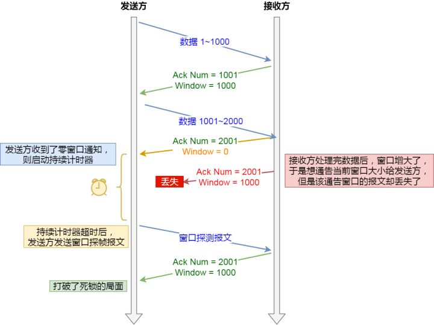
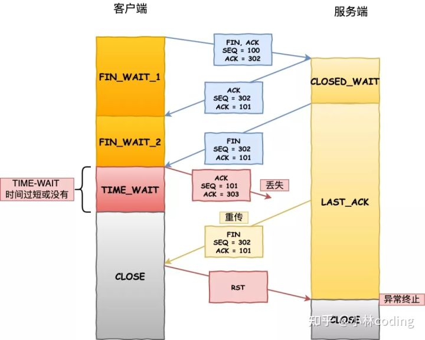

# 语言基础

## C++ cast强制类型转换

四种强制类型转换操作符：static_cast、dynamic_cast、const_cast、reinterpret_cast

### dynamic_cast

dynamic_cast是在运行时检查的，用于在集成体系中进行安全的向下转换downcast(当然也可以向上转换，但没必要，因为可以用虚函数实现)，基类指针/引用 -> 派生类指针/引用，如果源和目标没有继承/被继承关系，编译器会报错！

- dynamic_cast是4个转换中唯一的RTTI操作符，提供运行时类型检查
- dynamic_cast不是强制转换，而是带有某种”咨询“性质的，如果不能转换，返回NULL。这是强制转换做不到的
- 源类中必须要有虚函数，保证多态，才能使用dynamic_cast<source>(expression)
- 只用于对象的指针和引用，主要用于执行“安全的向下转型”，也就是说，要确定一个对象是否是一个继承体系中的一个特定类型。它是唯一不能用旧风格语法执行的强制转型，也是唯一可能有重大运行时代价的强制转型
- 当用于多态类型时（包含虚函数），它允许任意的隐式类型转换以及相反过程。不过，与static_cast不同，在后一种情况里（即隐式转换的相反过程），dynamic_cast根据RTTI信息检查操作是否有效。即在转换时dynamic_cast会检查转换是否能返回一个被请求的有效的完整对象。这种检查不是语法上的，而是真实情况的检查。检测在运行时进行，如果被转换的指针不是一个被请求的有效完整的对象指针，返回值为NULL。先看RTTI相关部分，通常，许多编译器都是通过vtable找到对象的RTTI信息的，这也就意味着，如果基类没有虚函数，也就无法判断一个基类指针变量所指对象的真实类型, 这时候dynamic_cast只能用来做安全的转换（upercasting），如从派生类指针转换成基类指针，而这种转换其实并不需要dynamic_cast参与

### static_cast

static_cast < type-id > ( expression )，该运算符把expression转换为type-id类型，但没有运行时类型检查来保证转换的安全性。它允许执行任意的隐式转换和相反转换动作

- 用于基本数据类型之间的转换，如把int转换成char，non-const 对象转型为 const 对象（这里相反方向不可以，C++只有const_cast可以）
- 把空指针转换成目标类型的指针。（之前的做法是用强制转换(type-id*)）
- 把任何类型的表达式转换成void类型
- 应用到类的指针上，它允许子类类型的指针转换为父类类型的指针（upercasting这是一个有效的隐式转换）；也能够执行相反动作，即转换父类为它的子类（downcasting），这种转换的安全性需要开发人员来保证（主要是在非上下转型中）
- 注意static_cast不能转换掉expression的const、volitale、或者__unaligned属性。在非基本类型或上下转型中，被转换的父类需要检查是否与目的类型相一致，否则，如果在两个完全不相干的类之间进行转换，将会导致编译出错

### reinterpret_cast

reinpreter_cast<type-id> (expression) type-id必须是一个指针、引用、算术类型、函数指针或者成员指针。它可以把一个指针转换成一个整数，也可以把一个整数转换成一个指针

- 这个操作符能够在非相关的类型之间转换。操作结果只是简单的从一个指针到别的指针的值的二进制拷贝。在类型之间指向的内容不做任何类型的检查和转换。reinpreter_cast是特意用于底层的强制转型，导致实现依赖（就是说，不可移植）的结果
- 仅仅是复制n1的比特位到d_r, 没有进行必要的分析.interpret_cast是为了映射到一个完全不同类型的意思，这个关键词在我们需要把类型映射回原有类型时用到它。我们映射到的类型仅仅是为了故弄玄虚和其他目的，这是所有映射中最危险的

### const_cast

const_cast<type_id> (expression) 用于修改类型的const或volatile属性。除了const 或volatile修饰之外，type_id和expression的类型是一样的，一般用于强制消除对象的常量性。它是唯一能做到这一点的 C++ 风格的强制转型，而C不提供消除const的机制

- 常量指针被转化成非常量指针，并且仍然指向原来的对象；常量引用被转换成非常量引用，并且仍然指向原来的对象；常量对象被转换成非常量对象

### static_cast与dynamic_cast比较

前者提供的是编译时期的静态类型检测,后者提供的是运行时检测

- static_cast：1完成基础数据类型，2同一个继承体系中类型的转换，3任意类型与空指针类型void*之间的转换
- dynamic_cast：使用多态的场景，增加了一层对真实调用对象类型的检查

## 虚函数

### 虚函数

   C++中的虚函数的作用主要是实现了多态的机制。关于多态，简而言之就是用父类型的指针指向其子类的实例，然后通过父类的指针调用实际子类的成员函数。这种技术可以让父类的指针有“多种形态”，这是一种泛型技术(所谓泛型技术，说白了就是试图使用不变的代码来实现可变的算法。比如：模板技术，RTTI技术，虚函数技术，要么是试图做到在编译时决议，要么试图做到运行时决议)

   如果调用非虚函数，则无论实际对象是什么类型，都执行基类类型所定义的函数。非虚函数总是在编译时根据调用该函数的对象，引用或指针的类型而确定。如果调用虚函数，则直到运行时才能确定调用哪个函数，运行的虚函数是引用所绑定或指针所指向的对象所属类型定义的版本

   虚函数必须是基类的非静态成员函数。虚函数的作用是实现动态联编，也就是在程序的运行阶段动态地选择合适的成员函数，在定义了虚函数后，可以在基类的派生类中对虚函数重新定义，在派生类中重新定义的函数应与虚函数具有相同的形参个数和形参类型。以实现统一的接口，不同定义过程。如果在派生类中没有对虚函数重新定义，则它继承其基类的虚函数

### 纯虚函数

   纯虚函数是在基类中声明的虚函数，它在基类中没有定义，但要求任何派生类都要定义自己的实现方法。在基类中实现纯虚函数的方法是在函数原型后加“=0”

   在很多情况下，基类本身生成对象是不合情理的。例如，动物作为一个基类可以派生出老虎、孔雀等子类，但动物本身生成对象明显不合常理。为了解决上述问题，将函数定义为纯虚函数，则编译器要求在派生类中必须予以重写以实现多态性。同时含有纯虚拟函数的类称为抽象类，它不能生成对象。这样就很好地解决了上述两个问题。将函数定义为纯虚函数能够说明，该函数为后代类型提供了可以覆盖的接口，但是这个类中的函数绝不会调用

   声明了纯虚函数的类是一个抽象类。所以，用户不能创建类的实例，只能创建它的派生类的实例。必须在继承类中重新声明函数（不要后面的＝0）否则该派生类也不能实例化，而且它们在抽象类中往往没有定义

   定义纯虚函数的目的在于，使派生类仅仅只是继承函数的接口。纯虚函数的意义，让所有的类对象（主要是派生类对象）都可以执行纯虚函数的动作，但类无法为纯虚函数提供一个合理的缺省实现。所以类纯虚函数的声明就是在告诉子类的设计者，“你必须提供一个纯虚函数的实现，但我不知道你会怎样实现它”

### 抽象类

   称带有纯虚函数的类为抽象类，抽象类是一种特殊的类，它是为了抽象和设计的目的为建立的，它处于继承层次结构的较上层。抽象类的主要作用是将有关的操作作为结果接口组织在一个继承层次结构中，由它来为派生类提供一个公共的根，派生类将具体实现在其基类中作为接口的操作。所以派生类实际上刻画了一组子类的操作接口的通用语义，这些语义也传给子类，子类可以具体实现这些语义，也可以再将这些语义传给自己的子类

   使用抽象类时注意，抽象类只能作为基类来使用，其纯虚函数的实现由派生类给出。如果派生类中没有重新定义纯虚函数，而只是继承基类的纯虚函数，则这个派生类仍然还是一个抽象类。如果派生类中给出了基类纯虚函数的实现，则该派生类就不再是抽象类了，它是一个可以建立对象的具体的类。抽象类是不能定义对象的

## 构造与析构函数

### 虚函数在构造函数中的作用

***构造函数为什么不能为虚函数？***

- 构造一个对象的时候，必须知道对象的实际类型，而虚函数行为是在运行期间确定实际类型的。而在构造一个对象时，由于对象还未构造成功。编译器无法知道对象 的实际类型，是该类本身，还是该类的一个派生类，或是更深层次的派生类
- 虚函数的执行依赖于[虚函数表](https://www.baidu.com/s?wd=虚函数表&tn=SE_PcZhidaonwhc_ngpagmjz&rsv_dl=gh_pc_zhidao)。而[虚函数表](https://www.baidu.com/s?wd=虚函数表&tn=SE_PcZhidaonwhc_ngpagmjz&rsv_dl=gh_pc_zhidao)在构造函数中进行初始化工作，即初始化vptr，让他指向正确的[虚函数表](https://www.baidu.com/s?wd=虚函数表&tn=SE_PcZhidaonwhc_ngpagmjz&rsv_dl=gh_pc_zhidao)。而在构造对象期间，虚函数表还没有被初 始化，将无法进行。虚函数的意思就是开启动态绑定，程序会根据对象的动态类型来选择要调用的方法。然而在构造函数运行的时候，这个对象的动态类型还不完整，没有办法确定它到底是什么类型，故构造函数不能动态绑定。（动态绑定是根据对象的动态类型而不是函数名，在调用构造函数之前，这个对象根本就不存在，它怎么动态绑定？）编译器在调用基类的构造函数的时候并不知道你要构造的是一个基类的对象还是一个派生类的对象

### 虚函数在析构函数中的作用

在类的继承中，如果有基类指针指向派生类，那么用基类指针delete时，如果不定义成虚函数，派生类中派生的那部分无法析构

### 几个注意事项

***构造函数和析构函数的几个知识点***

- 如果我们定义了一个构造函数，编译器就不会再为我们生成默认构造函数了
- 编译器生成的析构函数是非虚的，除非是一个子类，其父类有个虚析构，此时的函数虚特性来自父类
- 有虚函数的类，几乎可以确定要有个虚析构函数
- 如果一个类不可能是基类就不要申明析构函数为虚函数，虚函数是要耗费空间的
- 析构函数的异常退出会导致析构不完全，从而有内存泄露。最好是提供一个管理类，在管理类中提供一个方法来析构，调用者再根据这个方法的结果决定下一步的操作
- 在构造函数不要调用虚函数。在基类构造的时候，虚函数是非虚，不会走到派生类中，既是采用的静态绑定。显然的是：当我们构造一个子类的对象时，先调用基类的构造函数，构造子类中基类部分，子类还没有构造，还没有初始化，如果在基类的构造中调用虚函数，如果可以的话就是调用一个还没有被初始化的对象，那是很危险的，所以C++中是不可以在构造父类对象部分的时候调用子类的虚函数实现。但是不是说你不可以那么写程序，你这么写，编译器也不会报错。只是你如果这么写的话编译器不会给你调用子类的实现，而是还是调用基类的实现
- 在析构函数中也不要调用虚函数。在析构的时候会首先调用子类的析构函数，析构掉对象中的子类部分，然后在调用基类的析构函数析构基类部分，如果在基类的析构函数里面调用虚函数，会导致其调用已经析构了的子类对象里面的函数，这是非常危险的
- 记得在写派生类的拷贝函数时，调用基类的拷贝函数拷贝基类的部分

## 多态

### 多态类型

- 静态类型：对象声明的类型，是在编译时确定的
- 动态类型：目前所指对象的类型，是在运行时确定的

### 多态概念

- 静态多态（也叫编译时多态性）：函数重载和运算符的重载属于静态多态性，在程序编译时就能决定调用的是哪一个函数，静态多态是通过函数的重载来实现的（运算符重载实际上也属于函数的重载）
- 动态多态（又称运行时多态性）：程序运行过程中才动态地确定操作所针对的对象，运行时多态性是通过虚函数来实现的

## 内联函数和宏定义

### 内联的动机

   引入内联函数的目的是为了解决程序中函数调用的效率问题。函数是一种更高级的抽象。它的引入使得编程者只关心函数的功能和使用方法，而不必关心函数功能的具体实现；函数的引入可以减少程序的目标代码，实现程序代码和数据的共享。但是，函数调用也会带来降低效率的问题，因为调用函数实际上将程序执行顺序转移到函数所存放在内存中某个地址，将函数的程序内容执行完后，再返回到转去执行该函数前的地方。这种转移操作要求在转去前要保护现场并记忆执行的地址，转回后先要恢复现场，并按原来保存地址继续执行。因此，函数调用要有一定的时间和空间方面的开销，于是将影响其效率。特别是对于一些函数体代码不是很大，但又频繁地被调用的函数来讲，解决其效率问题更为重要。引入内联函数实际上就是为了解决这一问题，内联函数在调用时，是将调用表达式用内联函数体来替换

### 内联和宏定义

***宏定义缺点***

- 宏只做简单的字符串替换，函数是参数传递，所以必然有参数类型检查(支持各种类型，而不是只有字符串)
- 宏不经计算而直接替换参数，函数调用则是将参数表达式求值再传递给形参
- 宏在编译前进行，即先替换再编译。而函数是编译后，在执行时才调用的。宏占编译时间，而函数占执行时间
- 宏参数不占空间，因为只做字符串替换，而函数调用时参数传递是变量之间的传递，形参作为局部变量占内存空间
- 函数调用需要保留现场，然后转入调用函数执行，执行完毕再返回主调函数，这些耗费在宏中是没有的

***内联优点***

- 在使用时，宏只做简单的预处理器符号表(字符串)中的简单替换。而内联函数可以进行参数类型检查，且具有返回值(也能被强制转换为可转换的合适类型)
- 内联函数首先是函数，函数的许多性质都适用于内联函数(如内联函数可以重载)
- 内联函数可以作为某个类的成员函数，这样可以使用类的保护成员和私有成员。而当一个表达式涉及到类保护成员或私有成员时，宏就不能实现了(无法将this指针放在合适位置)
- 内联代码的调试信息通常比扩展的宏代码更有用
- 在宏中的编译错误很难发现，因为它们引用的是扩展的代码，而不是程序员键入的

***内联不适宜场景***

- 如果函数体内的代码比较长，使用内联将导致内存消耗代价较高
- 如果函数体内出现循环，那么执行函数体内代码的时间要比函数调用的开销大。类的构造函数和析构函数容易让人误解成使用内联更有效。要当心构造函数和析构函数可能会隐藏一些行为，如“偷偷地”执行了基类或成员对象的构造函数和析构函数。所以不要随便地将构造函数和析构函数的定义体放在类声明中。一个好的编译器将会根据函数的定义体，自动地取消不值得的内联（这进一步说明了 inline 应该出现在函数的声明文件中）
- 编译器比程序设计者更清楚对于一个特定的函数是否合适进行内联扩展；一些情况下，对于程序员指定的某些内联函数，编译器可能更倾向于不使用内联甚至根本无法完成内联
- 对于基于C的编译系统，内联函数的使用可能大大增加编译时间，因为每个调用该函数的地方都需要替换成函数体，代码量的增加也同时带来了潜在的编译时间的增加

### 虚函数是否可以是内联函数

虚函数是通过指针或引用调用函数时，通过虚函数表来确定调用的函数，在运行时确定。内联函数是在编译时，将调用函数处插入内联函数的代码，省去了函数调用时的开销。内联函数从原则上讲不能是虚函数，内联在编译期完成，而虚函数在执行时绑定。当使用非多态调用时，编译器可选择内联，许多时候，派生类的虚函数会调用基类的同名函数，这时候不是多态调用，可以内联。内联函数到底要不要在调用处展开取决于怎么调用内联函数，例如：

```cpp
#include <cstdio>

struct Base {
    virtual ~Base() {}
    virtual void Foo() { printf("Base::Foo()\n"); }
};

struct Derived : Base {
    virtual void Foo() { printf("Derived::Foo()\n"); }
};

Base* b = new Derived; // 非 static 令编译器不能在编译期知道 b 指向那个类型的对像

int main() {
    b->Foo();       // 不可能内联
    b->Base::Foo(); // 非多态调用，可以内联（但具体是否内联由编译器决定）
    delete b;
}
```

内联函数是个静态行为，而虚函数是个动态行为，他们之间是有矛盾的。我们之所以能看到一些象内联函数的虚函数，是因为某个函数是否是内联函数不是由我们说的算，而是由编译器决定的。我们只能向编译器建议，某个函数可以是内联函数(inline关键字)，但是编译器有自己的判断法则。所以可能出现这样的情况

- 我们用inline声明的函数却没有inline
- 我们没有用inline声明的函数却是inline
- 对于inline函数，编译器仍然将它编译成一个有地址的函数

所以，情况比较复杂，从high-level来看的话很难判断函数是否是inline的，如果从low-level来看的话就比较清晰，非内联函数遵从函数调用机制，在汇编中用call来调用。内联函数则没有这些。


## extern关键字

### 作用

- extern可以置于变量或者函数前，以标示变量或者函数的定义在别的文件中，提示编译器遇到此变量和函数时在其他模块中寻找其定义
- extern也可用来进行链接指定

### extern "C"

- 当它与"C"一起连用时，如: extern "C" void fun(int a, int b);则告诉编译器在编译fun这个函数名时按着C的规则去翻译相应的函数名而不是C++的，C++的规则在翻译这个函数名时会把fun这个名字变得面目全非，可能是fun@aBc_int_int#%$也可能是别的，这要看编译器的"脾气"了(不同的编译器采用的方法不一样)，为什么这么做呢，因为C++支持函数的重载
- 当extern不与"C"在一起修饰变量或函数时，如在头文件中: extern int g_Int; 它的作用就是声明函数或全局变量的作用范围的关键字，其声明的函数和变量可以在本模块活其他模块中使用，记住它是一个声明不是定义!也就是说B模块(编译单元)要是引用模块(编译单元)A中定义的全局变量或函数时，它只要包含A模块的头文件即可,在编译阶段，模块B虽然找不到该函数或变量，但它不会报错，它会在连接时从模块A生成的目标代码中找到此函数

## static 关键字

static 关键字作用

- 隐藏：当同时编译多个文件时，所有未加static前缀的全局变量和函数都具有全局可见性，如果加了static，就会对其它源文件隐藏。利用这一特性可以在不同的文件中定义同名函数和同名变量，而不必担心命名冲突

- 保持变量内容的持久：存储在静态数据区的变量会在程序刚开始运行时就完成初始化，也是唯一的一次初始化。共有两种变量存储在静态存储区：全局变量和static变量，只不过和全局变量比起来，static可以控制变量的可见范围，说到底static还是用来隐藏的

- 默认初始化为0：其实全局变量也具备这一属性，因为全局变量也存储在静态数据区。在静态数据区，内存中所有的字节默认值都是0x00，某些时候这一特点可以减少程序员的工作量。比如初始化一个稀疏矩阵，我们可以一个一个地把所有元素都置0，然后把不是0的几个元素赋值。如果定义成静态的，就省去了一开始置0的操作。再比如要把一个字符数组当字符串来用，但又觉得每次在字符数组末尾加‘\0’;太麻烦。如果把字符串定义成静态的，就省去了这个麻烦，因为那里本来就是‘\0’

- C++类声明为static:

  - 类的静态成员函数是属于整个类而非类的对象，所以它没有this指针，这就导致 了它仅能访问类的静态数据和静态成员函数
  - 不能将静态成员函数定义为虚函数
  - static并没有增加程序的时空开销，相反她还缩短了子类对父类静态成员的访问 时间，节省了子类的内存空间
  - 静态数据成员是静态存储的，所以必须对它进行初始化（程序员手动初始化，否则编译时一般不会报错，但是在Link时会报错误）
  - 静态成员初始化与一般数据成员初始化不同:1.初始化在类体外进行，而前面不加static，以免与一般静态变量或对象相混淆 2.初始化时不加该成员的访问权限控制符private，public等 3.初始化时使用作用域运算符来标明它所属类
  - 为了防止父类的影响，可以在子类定义一个与父类相同的静态变量，以屏蔽父类的影响。这里有一点需要注意：我们说静态成员为父类和子类共享，但我们有重复定义了静态成员，这会不会引起错误呢？不会，我们的编译器采用了一种绝妙的手法：name-mangling 用以生成唯一的标志

## volatile关键字

  ​ volatile 关键字是一种类型修饰符，用它声明的类型变量表示可以被某些编译器未知的因素更改，比如：操作系统、硬件或者其它线程等。遇到这个关键字声明的变量，编译器对访问该变量的代码就不再进行优化，从而可以提供对特殊地址的稳定访问。声明时语法：int volatile vInt; 当要求使用 volatile 声明的变量的值的时候，系统总是重新从它所在的内存读取数据，即使它前面的指令刚刚从该处读取过数据，而且读取的数据立刻被保存

### 使用场景

- 中断服务程序中修改的供其它程序检测的变量需要加volatile
- 多任务环境下各任务间共享的标志应该加volatile
- 存储器映射的硬件寄存器通常也要加volatile说明，因为每次对它的读写都可能由不同意义

### 使用限制

- 和 const 修饰词类似，const 有常量指针和指针常量的说法，volatile 也有相应的概念
- 可以把一个非volatile int赋给volatile int，但是不能把非volatile对象赋给一个volatile对象
- 除了基本类型外，对用户定义类型也可以用volatile类型进行修饰
- C++中一个有volatile标识符的类只能访问它接口的子集，一个由类的实现者控制的子集。用户只能用const_cast来获得对类型接口的完全访问。此外，volatile向const一样会从类传递到它的成员

### 多线程下的volatile

当两个线程都要用到某一个变量且该变量的值会被改变时，应该用volatile声明，该关键字的作用是防止优化编译器把变量从内存装入CPU寄存器中。如果变量被装入寄存器，那么两个线程有可能一个使用内存中的变量，一个使用寄存器中的变量，这会造成程序的错误执行。volatile的意思是让编译器每次操作该变量时一定要从内存中真正取出，而不是使用已经存在寄存器中的值

## explicit关键字

在C++中，一个参数的构造函数（或者除了第一个参数外其余参数都有默认值的多参构造函数）一般具有两个功能：构造器和默认且隐含的类型转换操作符。所以，当AAA=XXX，恰好XXX的类型正好是AAA单参数构造器的参数类型，这时候编译器就自动调用这个构造器，创建一个AAA的对象。而在某些情况下，却违背了程序员的本意，此时就要在这个构造器前面加上explicit修饰，制定这个构造器只能被明确地调用、使用，不能作为类型转换操作符被隐含地使用

## 仿函数

函数(functor)又称之为函数对象（function object），其实就是重载了operator（）操作符的struct或class，没有什么特别的地方。仿函数(functor)使一个类的使用看上去象一个函数，这个类就有了类似函数的行为，就是一个仿函数类了

***为什么使用仿函数?***

- 仿函数比一般的函数灵活
- 仿函数有类型识别，可以作为模板参数
- 执行速度上仿函数比函数和指针要更快的

## placement new

placement new它本质上是对operator new的重载，在用户指定的内存位置上构建新的对象，这个构建过程不需要额外分配内存，只需要调用对象的构造函数即可，之后返回指定的内存地址。有placement new 时必须对应写上它的 placement delete版本，因为当使用new运算符时如果第二步的构造函数出现异常，编译器就会自动调用placement delete将第一步分配出来的空间还回去，这样想是完全正确的，分配空间已经完成，但是调用构造函数为空间赋值时出异常，就得将空间还回去。

gcc下有自身默认版本的placement new和placement delete

```cpp
// Default placement versions of operator new.
_GLIBCXX_NODISCARD inline void* operator new(std::size_t, void* __p) _GLIBCXX_USE_NOEXCEPT
{ return __p; }
_GLIBCXX_NODISCARD inline void* operator new[](std::size_t, void* __p) _GLIBCXX_USE_NOEXCEPT
{ return __p; }

// Default placement versions of operator delete.
inline void operator delete  (void*, void*) _GLIBCXX_USE_NOEXCEPT { }
inline void operator delete[](void*, void*) _GLIBCXX_USE_NOEXCEPT { }
```

注意事项：

- placement new操作，既可以在栈(stack)上生成对象，也可以在堆（heap）上生成对象。如本例就是在栈上生成一个对象
- 使用语句A *p=new (mem) A;placement new生成对象时，会自动调用类A的构造函数，但是由于对象的空间不会自动释放（对象实际上是借用别人的空间），所以必须显示的调用类的析构函数，如本例中的p->~A()，不要使用delete，否则会导致内存的二次释放

# 网络与协议

## 三次握手和四次挥手

### 三次握手

- 第一次握手：Client将标志位SYN置为1，随机产生一个值seq=J，并将该数据包发送给Server，Client进入SYN_SENT状态，等待Server确认
- 第二次握手：Server收到数据包后由标志位SYN=1知道Client请求建立连接，Server将标志位SYN和ACK都置为1，ack=J+1，随机产生一个值seq=K，并将该数据包发送给Client以确认连接请求，Server进入SYN_RCVD状态
- 第三次握手：Client收到确认后，检查ack是否为J+1，ACK是否为1，如果正确则将标志位ACK置为1，ack=K+1，并将该数据包发送给Server，Server检查ack是否为K+1，ACK是否为1，如果正确则连接建立成功，Client和Server进入ESTABLISHED状态，完成三次握手，随后Client与Server之间可以开始传输数据了

### 四次挥手

- 第一次挥手：Client发送一个FIN，用来关闭Client到Server的数据传送，Client进入FIN_WAIT_1状态
- 第二次挥手：Server收到FIN后，发送一个ACK给Client，确认序号为收到序号+1（与SYN相同，一个FIN占用一个序号），Server进入CLOSE_WAIT状态
- 第三次挥手：Server发送一个FIN，用来关闭Server到Client的数据传送，Server进入LAST_ACK状态
- 第四次挥手：Client收到FIN后，Client进入TIME_WAIT状态，接着发送一个ACK给Server，确认序号为收到序号+1，Server进入CLOSED状态，完成四次挥手

###  图解


###  拓展

- 为什么建立连接是三次握手，而关闭连接却是四次挥手呢

  这是因为服务端在LISTEN状态下，收到建立连接请求的SYN报文后，把ACK和SYN放在一个报文里发送给客户端。而关闭连接时，当收到对方的FIN报文时，仅仅表示对方不再发送数据了但是还能接收数据，己方也未必全部数据都发送给对方了，所以己方可以立即close，也可以发送一些数据给对方后，再发送FIN报文给对方来表示同意现在关闭连接，因此，己方ACK和FIN一般都会分开发送

- 改进三次挥手完成TCP连接的关闭

  - 当主机A的应用程序通知TCP数据已经发送完毕，TCP向主机B发送一个带有FIN附加标记的报文
  - 主机B收到这个FIN报文段之后，并不立即用FIN报文段回复主机A，二级先向主机A发送一个确认序号A，同时通知主机相应的应用程序：对方要求关闭连接（先发送ACK的目的是为了防止在这段时间内，对方重传FIN报文段）
  - 主机B的应用程序告诉TCP：我要彻底的关闭连接，TCP向主机A发送一个FIN报文段，主机A收到这个FIN报文段后，向主机B发送一个ACK表示连接彻底释放

- SYN攻击

  在三次握手过程中，Server发送SYN-ACK之后，收到Client的ACK之前的TCP连接称为半连接（half-open connect），此时Server处于SYN_RCVD状态，当收到ACK后，Server转入ESTABLISHED状态。SYN攻击就是Client在短时间内伪造大量不存在的IP地址，并向Server不断地发送SYN包，Server回复确认包，并等待Client的确认，由于源地址是不存在的，因此，Server需要不断重发直至超时，这些伪造的SYN包将产时间占用未连接队列，导致正常的SYN请求因为队列满而被丢弃，从而引起网络堵塞甚至系统瘫痪。SYN攻击时一种典型的DDOS攻击，检测SYN攻击的方式非常简单，即当Server上有大量半连接状态且源IP地址是随机的，则可以断定遭到SYN攻击了

- 为什么要采用三次握手，两次行不行

  先假定出现一种异常情况，即A发出的第一个连接请求报文段并没有丢失，而是在某些网络结点长时间滞留了，以至延误到连接释放以后的某个时间才到达B。本来这是一个早已失效的报文段。但是B收到此失效的连接请求报文段后，就误以为是Ａ又发出一次新的请求。于是就向A发出确认报文段，同意建立连接。假定不采用三次握手，那么只要B发出请求，新的连接就建立了。由于现在A并没有发出建立连接的请求，因此不会理睬B的确认，也不会向B发送数据。但B却以为新的运输连接已经建立了，并一直等待A发送数据。B的许多资源就这样白白浪费了。采用三次握手的办法可以防止以上现象的发生。例如在刚才的情况下，A不会向B的确认发出确认。B由于收不到确认，就知道A并没有要求建立连接

- 为什么A在TIME-WAIT状态必须等待2MSL的时间

  - 为了保证A发送的最后一个ACK报文能够到达B。这个ACK报文段有可能丢失，因而使处在LAST-ACK状态的B收不到对方已发送的FIN+ACK报文段的确认。B会超时重传这个FIN+ACK报文段，而A就能在2MSL时间内收到这个重传的FIN+ACK报文段。接着A重传一次确认，重新启动2MSL计时器。最后，A和B都正常进入到CLOSED状态。如果A在TIME-WAIT状态不等一段时间，而是在发送完ACK报文段后立即释放连接，那么就无法收到B重传的FIN+ACK报文段，因而也不会再次发送一次确认报文段。这样，B就无法按照正常步骤进入CLOSED状态
  - 防止已失效的连接请求报文段出现在本连接中。A在发送完最后一个ACK报文段后，再经过时间2MSL，就可以是本连接持续的时间内所产生的所有报文段都从网络中消失。这样就可以使下一个新的连接中不会出现这种旧的连接请求报文段。（MSL是Maximum Segment Lifetime英文的缩写，中文可以译为“报文最大生存时间”，他是任何报文在网络上存在的最长时间，超过这个时间报文将被丢弃）

## select/poll/epoll区别

select，poll，epoll都是IO多路复用的机制。I/O多路复用就通过一种机制，可以监视多个描述符，一旦某个描述符就绪（一般是读就绪或者写就绪），能够通知程序进行相应的读写操作。***但select，poll，epoll本质上都是同步I/O，因为他们都需要在读写事件就绪后自己负责进行读写，也就是说这个读写过程是阻塞的***，而异步I/O则无需自己负责进行读写，异步I/O的实现会负责把数据从内核拷贝到用户空间

### select的缺点

- 个进程能够监视的文件描述符的数量存在最大限制，通常是1024，当然可以更改数量，但由于select采用轮询的方式扫描文件描述符，文件描述符数量越多，性能越差；(在linux内核头文件中，有这样的定义：#define __FD_SETSIZE  1024)
- 内核 / 用户空间内存拷贝问题，select需要复制大量的句柄数据结构，产生巨大的开销
- select返回的是含有整个句柄的数组，应用程序需要遍历整个数组才能发现哪些句柄发生了事件
- select的触发方式是水平触发，应用程序如果没有完成对一个已经就绪的文件描述符进行IO操作，那么之后每次select调用还是会将这些文件描述符通知进程

### poll缺点

- 相比select模型，poll使用链表保存文件描述符，因此没有了监视文件数量的限制，但其他三个缺点依然存在

### linux内核中epoll机制实现思路

epoll的设计和实现与select完全不同。epoll通过在Linux内核中申请一个简易的文件系统(文件系统一般用什么数据结构实现？B+树)。把原先的select/poll调用分成了3个部分

- 调用epoll_create()建立一个epoll对象(在epoll文件系统中为这个句柄对象分配资源)
- 调用epoll_ctl向epoll对象中添加这N个连接的套接字
- 调用epoll_wait收集发生的事件的连接


# 算法

## 如何解决hash冲突

### 解决方法

- 开放定址法
  - 线性探测再散列
  - 平方探测再散列
  - 伪随机探测再散列
- 再哈希法
- 链地址法
- 建立公共溢出区

### 链地址法优缺点

链地址优点（开放散列）：

- 对于记录总数频繁可变的情况，处理的比较好（也就是避免了动态调整的开销）
- 由于记录存储在结点中，而结点是动态分配，不会造成内存的浪费，所以尤其适合那种记录本身尺寸（size）很大的情况，因为此时指针的开销可以忽略不计了
- 删除记录时，比较方便，直接通过指针操作即可

链地址缺点（开放散列）：

- 存储的记录是随机分布在内存中的，这样在查询记录时，相比结构紧凑的数据类型（比如数组），哈希表的跳转访问会带来额外的时间开销
- 如果所有的 key-value 对是可以提前预知，并之后不会发生变化时（即不允许插入和删除），可以人为创建一个不会产生冲突的完美哈希函数（perfect hash function），此时封闭散列的性能将远高于开放散列
- 由于使用指针，记录不容易进行序列化（serialize）操作

### 开放定址法优缺点

开放定址法优点（封闭散列）：

- 记录更容易进行序列化（serialize）操作
- 如果记录总数可以预知，可以创建完美哈希函数，此时处理数据的效率是非常高的

开放定址法缺点（封闭散列）：

- 存储记录的数目不能超过桶数组的长度，如果超过就需要扩容，而扩容会导致某次操作的时间成本飙升，这在实时或者交互式应用中可能会是一个严重的缺陷
- 使用探测序列，有可能其计算的时间成本过高，导致哈希表的处理性能降低
- 由于记录是存放在桶数组中的，而桶数组必然存在空槽，所以当记录本身尺寸（size）很大并且记录总数规模很大时，空槽占用的空间会导致明显的内存浪费，删除记录时，比较麻烦。比如需要删除记录a，记录b是在a之后插入桶数组的，但是和记录a有冲突，是通过探测序列再次跳转找到的地址，所以如果直接删除a，a的位置变为空槽，而空槽是查询记录失败的终止条件，这样会导致记录b在a的位置重新插入数据前不可见，所以不能直接删除a，而是设置删除标记。这就需要额外的空间和操作

## 常见的几种排序算法

### 排序算法复杂度


### 排序算法的局限性

- 当原表有序或基本有序时，直接插入排序和冒泡排序将大大减少比较次数和移动记录的次数，时间复杂度可降至O(n)
- 而快速排序则相反，当原表基本有序时，将蜕化为冒泡排序，时间复杂度提高为O(n^2)
- 原表是否有序，对简单选择排序、堆排序、归并排序和基数排序的时间复杂度影响不大

### 排序算法的稳定性

- 稳定性：若待排序的序列中，存在多个具有相同关键字的记录，经过排序， 这些记录的相对次序保持不变，则称该算法是稳定的；若经排序后，记录的相对 次序发生了改变，则称该算法是不稳定的
- 稳定性的好处：排序算法如果是稳定的，那么从一个键上排序，然后再从另一个键上排序，第一个键排序的结果可以为第二个键排序所用。基数排序就是这样，先按低位排序，逐次按高位排序，低位相同的元素其顺序再高位也相同时是不会改变的。另外，如果排序算法稳定，可以避免多余的比较
- 稳定的排序算法：冒泡排序、插入排序、归并排序和基数排序
- 不是稳定的排序算法：选择排序、快速排序、希尔排序、堆排序

### 排序算法应用选择

影响排序的因素有很多，平均时间复杂度低的算法并不一定就是最优的。相反，有时平均时间复杂度高的算法可能更适合某些特殊情况。同时，选择算法时还得考虑它的可读性，以利于软件的维护。一般而言，需要考虑的因素有以下四点：

- 待排序的记录数目n的大小
- 记录本身数据量的大小，也就是记录中除关键字外的其他信息量的大小
- 关键字的结构及其分布情况
- 对排序稳定性的要求

设待排序元素的个数为n：

***当n较大，则应采用时间复杂度为O(nlog2n)的排序方法：快速排序、堆排序或归并排序***

- 快速排序：是目前基于比较的内部排序中被认为是最好的方法，当待排序的关键字是随机分布时，快速排序的平均时间最短的
- 堆排序 ：所需的辅助空间少于快速排序，并且不会出现快速排序可能出现的最坏情况
- 归并排序：要求排序稳定，则可选用归并排序。但前面介绍的从单个记录起进行两两归并的排序算法并不值得提倡，通常可以将它和直接插入排序结合在一起使用。先利用直接插入排序求得较长的有序子序列，然后再两两归并之。因为直接插入排序是稳定 的，所以改进后的归并排序仍是稳定的

***当n较小，可采用直接插入或直接选择排序***

- 直接插入排序：当元素分布有序，直接插入排序将大大减少比较次数和移动记录的次数
- 直接选择排序 ：元素分布有序，如果不要求稳定性，选择直接选择排序

***一般不使用或不直接使用传统的冒泡排序***

***基数排序：它是一种稳定的排序算法，但有一定的局限性***

- 关键字可分解
- 记录的关键字位数较少，如果密集更好
- 如果是数字时，最好是无符号的，否则将增加相应的映射复杂度，可先将其正负分开排序

# 附-专题

## shared_ptr的那些坑

### 共享所有权

一个动态分配的对象可以在多个shared_ptr之间共享，这是因为shared_ptr支持 copy 操作：

```cpp
shared_ptr<string> ptr1{ new string("hello") };
auto ptr2 = ptr1;　// copy constructor
```

### 原理介绍

`shared_ptr`内部包含两个指针，一个指向对象，另一个指向控制块(control block)，控制块中包含一个引用计数和其它一些数据。由于这个控制块需要在多个`shared_ptr`之间共享，所以它也是存在于 heap 中的。`shared_ptr`对象本身是线程安全的，也就是说`shared_ptr`的引用计数增加和减少的操作都是原子的。


### shared_ptr的风险

你大概觉得使用智能指针就再也高枕无忧了，不再为内存泄露烦恼了。然而梦想总是美好的，使用`shared_ptr`时，不可避免地会遇到循环引用的情况，这样容易导致内存泄露。循环引用就像下图所示，通过`shared_ptr`创建的两个对象，同时它们的内部均包含`shared_ptr`指向对方。


```cpp
// 一段内存泄露的代码
struct Son;

struct Father　{
    shared_ptr<Son> son_;
};

struct Son {
    shared_ptr<Father> father_;
};

int main() 
{
    auto father = make_shared<Father>();
    auto son = make_shared<Son>();
    father->son_ = son;
    son->father_ = father;
  
    return 0;
}
```

分析一下`main`函数是如何退出的，一切就都明了：

- `main`函数退出之前，`Father`和`Son`对象的引用计数都是`2`。
- `son`指针销毁，这时`Son`对象的引用计数是`1`。
- `father`指针销毁，这时`Father`对象的引用计数是`1`。
- 由于`Father`对象和`Son`对象的引用计数都是`1`，这两个对象都不会被销毁，从而发生内存泄露。

为避免循环引用导致的内存泄露，就需要使用`weak_ptr`，`weak_ptr`并不拥有其指向的对象，也就是说，让`weak_ptr`指向`shared_ptr`所指向对象，对象的引用计数并不会增加：

```cpp
auto ptr = make_shared<string>("senlin");
weak_ptr<string> wp1{ ptr };
cout << "use count: " << ptr.use_count() << endl;// use count: 1
```

使用`weak_ptr`就能解决前面提到的循环引用的问题，方法很简单，只要让`Son`或者`Father`包含的`shared_ptr`改成`weak_ptr`就可以了。

```cpp
// 修复内存泄露的问题
struct Son;

struct Father　{
    shared_ptr<Son> son_;
};

struct Son {
    weak_ptr<Father> father_;
};

int main() 
{
    auto father = make_shared<Father>();
    auto son = make_shared<Son>();
    father->son_ = son;
    son->father_ = father;
  
    return 0;
}
```

同样，分析一下`main`函数退出时发生了什么：

- `main`函数退出前，`Son`对象的引用计数是`2`，而`Father`的引用计数是`1`。
- `son`指针销毁，`Son`对象的引用计数变成`1`。
- `father`指针销毁，`Father`对象的引用计数变成`0`，导致`Father`对象析构，`Father`对象的析构会导致它包含的`son_`指针被销毁，这时`Son`对象的引用计数变成`0`，所以`Son`对象也会被析构。

然而，`weak_ptr`并不是完美的，因为`weak_ptr`不持有对象，所以不能通过`weak_ptr`去访问对象的成员，例如：

```cpp
struct Square {
    int size = 0;
};

auto sp = make_shared<Square>();
weak_ptr<Square> wp{ sp };
cout << wp->size << endl;   // compile-time ERROR
```

你可能猜到了，既然`shared_ptr`可以访问对象成员，那么是否可以通过`weak_ptr`去构造`shared_ptr`呢？事实就是这样，实际上`weak_ptr`只是作为一个转换的桥梁（proxy），通过`weak_ptr`得到`shared_ptr`，有两种方式：

- 调用`weak_ptr`的`lock()`方法，要是对象已被析构，那么`lock()`返回一个空的`shared_ptr`。
- 将`weak_ptr`传递给`shared_ptr`的构造函数，要是对象已被析构，则抛出`std::exception`异常。

既然`weak_ptr`不持有对象，也就是说`weak_ptr`指向的对象可能析构了，但`weak_ptr`却不知道。所以需要判断`weak_ptr`指向的对象是否还存在，有两种方式：

- `weak_ptr`的`use_count()`方法，判断引用计数是否为`0`。
- 调用`weak_ptr`的`expired()`方法，若对象已经被析构，则`expired()`将返回`true`。

转换过后，就可以通过`shared_ptr`去访问对象了：

```cpp
auto sp = make_shared<Square>();
weak_ptr<Square> wp{ sp };
    
if (!wp.expired()) 
{
    auto ptr = wp.lock();      // get shared_ptr
    cout << ptr->size << endl;
}
```

### 1.4销毁操作

为`shared_ptr`指定 deleter 的做法很简单：

```cpp
shared_ptr<string> ptr( new string("hello"), 
                        []( string *p ) {
                            cout << "delete hello" << endl;
                        });
ptr = nullptr;
cout << "Before the end of main()" << endl;
/**
delete hello
Before the end of main()
**/
```

与`unique_ptr`不同，标准库并不提供`shared_ptr<T[]>`，因此，使用`shared_ptr`处理数组时需要显示指定删除行为，例如：

```cpp
shared_ptr<string> ptr1( new string[10], 
                         []( string *p ) {
                             delete[] p;
                         });
shared_ptr<string> ptr2( new string[10],
                         std::default_delete<string[]>() );
```

由于不存在`shared_ptr<T[]>`，我们无法使用`[]`来访问数组中的元素，实际上无法访问到数组中的元素。也就是说使用`shared_ptr`来指向数组意义并不大。若想要数组在多个`shared_ptr`之间共享，可以考虑使用`shared_ptr<vector>`或`shared_ptr<array>`。

### 1.5更多陷阱

使用`shared_ptr`时，注意不能直接通过同一个 raw pointer 指针来构造多个`shared_ptr`：

```cpp
int *p = new int{10};
shared_ptr<int> ptr1{ p };
shared_ptr<int> ptr2{ p };         // ERROR
```

很明显，每次通过 raw pointer 来构造`shared_ptr`时候就会分配一个控制块，这时存在两个控制块，也就是说存在两个引用计数。这显然是错误的，因为当这两个`shared_ptr`被销毁时，对象将会被`delete`两次。

考虑到`this`也是 raw pointer，所以一不小心就会用同一个`this`去构造多个`shared_ptr`了，就像这样：

```cpp
class Student
{
public:
    Student( const string &name ) : name_( name ) { }

    void addToGroup( vector<shared_ptr<Student>> &group ) {
        group.push_back( shared_ptr<Student>(this) );          // ERROR
    }
private:
    string name_;
};
```

每次调用`addToGroup()`时都会创建一个控制块，所以这个对象会对应多个引用计数，最终这个对象就会被`delete`多次，导致运行出错。解决这个问题很简单，只要让`std::enable_shared_from_this<Student>`作为`Student`的基类：

```cpp
class Student : public std::enable_shared_from_this<Student>
{
public:
    Student( const string &name ) : name_( name ) { }

    void addToGroup( vector<shared_ptr<Student>> &group ) {
        group.push_back( shared_from_this() );              // OK
    }
private:
    string name_;
};
```

需要注意，调用`shared_from_this()`之前需要确保对象被`share_ptr`所持有，理解这一点是很容易的，因为只有当对象被`shared_ptr`所持有，使用`shared_from_this()`所返回的`shared_ptr`才会指向同一个对象。

```cpp
vector<shared_ptr<Student>> group;
// Good: ensure object be owned by shared_ptr
auto goodStudent = make_shared<Student>( "senlin" );
goodStudent->addToGroup( group );
Student badStudent1( "bad1" );
badStudent1.addToGroup( group );           // ERROR
auto badStudent2 = new Student( "bad2" );
badStudent2->addToGroup( group );          // ERROR
```

在调用`shared_from_this()`之前需要确保对象被`shared_ptr`所持有，要使得对象被`shared_ptr`所持有，对象首先要初始化（调用构造函数），所以一定不能在`Student`的构造函数中调用`shared_from_this()`：

```cpp
class Student : public std::enable_shared_from_this<Student>
{
public:
    Student( const string &name, vector<shared_ptr<Student>> &group )
        : name_( name ) 
    {
        // ERROR: shared_from_this() can't be call in object's constructor
        group.push_back( shared_from_this() );
    }
private:
    string name_;
};
```

好了，那么问题来了：

- 要怎样才能防止用户以不正确的方式来创建`Student`对象呢？
- 同时也要使得，我们可以使用不同的构造方式来创建`Student`对象。

可以将`Student`的构造函数声明为`private`的，因此，用户无法直接创建`Student`对象。另一方面，增加`create()`成员函数，在这个函数里面，我们使用 C++11 的 variadic templates 特性，调用`Student`的构造函数来构造对象：

```cpp
class Student : public std::enable_shared_from_this<Student>
{
private:
    Student( const string &name ) : name_( name ) { }

    Student( const Student &rhs ) : name_( rhs.name_ ) { }

    // can have other constructor
public:
    template <typename... Args>
    static shared_ptr<Student> create( Args&&... args ) {
        return shared_ptr<Student>(new Student(std::forward<Args>(args)...));
    }

    void addToGroup( vector<shared_ptr<Student>> &group ) {
        group.push_back( shared_from_this() );
    }
private:
    string name_;
};
```

通过`create()`保证了用户创建的对象总是被`shared_ptr`所持有，可以将`create()`想象成`Student`构造函数的别名：

```cpp
vector<shared_ptr<Student>> group;
auto student1 = Student::create("senlin");
student1->addToGroup(group);
cout << "student1.use_count() = " << student1.use_count() << endl;
// student1.use_count() = 2
```

### 1.6性能考虑

```cpp
shared_ptr<std::string> ptr{ new string("hello") };
```

使用这种方式创建`shared_ptr`时，需要执行两次`new`操作，一次在 heap 上为`string("hello")`分配内存，另一次在 heap 上为控制块分配内存。使用`make_shared`来创建`shared_ptr`会高效，因为`make_shared`仅使用`new`操作一次，它的做法是在 heap 上分配一块连续的内存用来容纳`string("hello")`和控制块。同样，当`shared_ptr`的被析构时，也只需一次`delete`操作。

```cpp
auto ptr = std::make_shared<std::string>("hello");
```


## TCP连接

### Time_wait和Close_wait

> 1.Socket的关闭的过程（四次挥手）
> 2.time_wait 产生原因（存在的合理性）（等待2MSL意义）
> 3.time_wait过多产生原因
> 4.time_wait过多解决方法
> 5.close_wait产生原因
> 6.close_wait产生太多原因：
> 7.close_wait太多解决方法：
> 8.Socket连接到底是个什么概念？
> 9.什么时候用长连接，短连接？
> 10.报文发送接收方式 （同步和异步）？

#### Socket的关闭的过程（四次挥手）

- 主动关闭连接的一方，调用close()；协议层发送FIN包
- 被动关闭的一方收到FIN包后，协议层回复ACK；然后被动关闭的一方，进入CLOSE_WAIT状态，主动关闭的一方等待对方关闭，则进入FIN_WAIT_2状态；此时，主动关闭的一方 等待 被动关闭一方的应用程序，调用close操作。
- 被动关闭的一方在完成所有数据发送后，调用close()操作；此时，协议层发送FIN包给主动关闭的一方，等待对方的ACK，被动关闭的一方进入LAST_ACK状态；
- 主动关闭的一方收到FIN包，协议层回复ACK；此时，主动关闭连接的一方，进入TIME_WAIT状态；而被动关闭的一方，进入CLOSED状态
- 等待2MSL时间，如没发现重传的FIN，主动关闭的一方，结束TIME_WAIT，进入CLOSED状态


`CLOSED：`无连接是活动的或正在进行
`LISTEN：`服务器在等待进入呼叫
`SYN_RECV：`一个连接请求已经到达，等待确认
`SYN_SENT：`应用已经开始，打开一个连接
`ESTABLISHED：`正常数据传输状态
`FIN_WAIT1：`应用说它已经完成
`FIN_WAIT2：`另一边已同意释放
`ITMED_WAIT：`等待所有分组死掉
`CLOSING：`两边同时尝试关闭
`TIME_WAIT：`另一边已初始化一个释放
`LAST_ACK：`等待所有分组死掉

#### time_wait 产生原因(存在的合理性)（等待2MSL意义）

MSL：报文段最大生存时间，它是任何报文段被丢弃前在网络内的最长时间。原因有二：

- 保证TCP协议的全双工连接能够可靠关闭
- 保证这次连接的重复数据段从网络中消失

**第一点：** 如果主机1直接CLOSED了，那么由于IP协议的不可靠性或者是其它网络原因，导致主机2没有收到主机1最后回复的ACK。那么主机2就会在超时之后继续发送FIN，此时由于主机1已经CLOSED了，就找不到与重发的FIN对应的连接。所以，主机1不是直接进入CLOSED，而是要保持TIME_WAIT，当再次收到FIN的时候，能够保证对方收到ACK，最后正确的关闭连接。

**第二点：** 如果主机1直接CLOSED，然后又再向主机2发起一个新连接，我们不能保证这个新连接与刚关闭的连接的端口号是不同的。也就是说有可能新连接和老连接的端口号是相同的。一般来说不会发生什么问题，但是还是有特殊情况出现：假设新连接和已经关闭的老连接端口号是一样的，如果前一次连接的某些数据仍然滞留在网络中，这些延迟数据在建立新连接之后才到达主机2，由于新连接和老连接的端口号是一样的，TCP协议就认为那个延迟的数据是属于新连接的，这样就和真正的新连接的数据包发生混淆了。所以TCP连接还要在TIME_WAIT状态等待2倍MSL，这样可以保证本次连接的所有数据都从网络中消失。

#### time_wait过多产生原因

在高并发短连接的TCP服务器上，当服务器处理完请求后立刻主动正常关闭连接。主动关闭的一方在发送最后一个 ack 后就会进入TIME_WAIT 状态 停留2MSL（max segment lifetime）的时间，这个场景下，会出现大量socket处于TIMEWAIT状态。如果客户端的并发量持续很高，此时部分客户端就会显示连接不上。

- 高并发让服务器在短时间范围内同时占用大量端口，而端口只0~65535的范围，有限
- 短连接表示“业务处理+传输数据的时间 远远小于 TIMEWAIT超时的时间”的连接

正常的TCP客户端连接在关闭后，会进入一个TIME_WAIT的状态，持续的时间一般在1-4分钟，对于连接数不高的场景，1-4分钟其实并不长，对系统也不会有什么影响，但如果短时间内（例如1s内）进行大量的短连接，则可能出现这样一种情况：客户端所在的操作系统的socket端口和文件描述符被用尽，系统无法再发起新的连接！

假设每秒建立了1000个短连接（Web场景下是很常见的，例如每个请求都去访问memcached），假设TIME_WAIT的时间是1分钟，则1分钟内需要建立6W个短连接，由于TIME_WAIT时间是1分钟，这些短连接1分钟内都处于TIME_WAIT状态，都不会释放，而Linux默认的本地端口范围配置是：net.ipv4.ip_local_port_range = 32768 61000不到3W，因此这种情况下新的请求由于没有本地端口就不能建立了

#### time_wait过多解决方法

- 可以改为长连接，但代价较大，长连接太多会导致服务器性能问题并且安全性也较差

- 修改ipv4.ip_local_port_range，增大可用端口范围，但只能缓解问题，不能根本解决问题

- 客户端机器打开tcp_tw_reuse和tcp_timestamps选项

  > 字面意思，reuse TIME_WAIT状态的连接。时刻记住一条socket连接，就是那个五元组，出现TIME_WAIT状态的连接，一定出现在主动关闭连接的一方。所以，当主动关闭连接的一方，再次向对方发起连接请求的时候（例如，客户端关闭连接，客户端再次连接服务端，此时可以复用了；负载均衡服务器，主动关闭后端的连接，当有新的HTTP请求，负载均衡服务器再次连接后端服务器，此时也可以复用），可以复用TIME_WAIT状态的连接。
  > 通过字面解释，以及例子说明，你看到了，tcp_tw_reuse应用的场景：某一方，需要不断的通过“短连接”连接其他服务器，总是自己先关闭连接(TIME_WAIT在自己这方)，关闭后又不断的重新连接对方。
  > 那么，当连接被复用了之后，延迟或者重发的数据包到达，新的连接怎么判断，到达的数据是属于复用后的连接，还是复用前的连接呢？那就需要依赖前面提到的两个时间字段了。复用连接后，这条连接的时间被更新为当前的时间，当延迟的数据达到，延迟数据的时间是小于新连接的时间，所以，内核可以通过时间判断出，延迟的数据可以安全的丢弃掉了。
  > 这个配置，依赖于连接双方，同时对timestamps的支持。同时，这个配置，仅仅影响outbound连接，即做为客户端的角色，连接服务端[connect(dest_ip, dest_port)]时复用TIME_WAIT的socket。

- 客户端机器打开tcp_tw_recycle和tcp_timestamps选项

  > 字面意思，销毁掉 TIME_WAIT。
  > 当开启了这个配置后，内核会快速的回收处于TIME_WAIT状态的socket连接。多快？不再是2MSL，而是一个RTO（retransmission timeout，数据包重传的timeout时间）的时间，这个时间根据RTT动态计算出来，但是远小于2MSL。
  > 有了这个配置，还是需要保障 丢失重传或者延迟的数据包，不会被新的连接(注意，这里不再是复用了，而是之前处于TIME_WAIT状态的连接已经被destroy掉了，新的连接，刚好是和某一个被destroy掉的连接使用了相同的五元组而已)所错误的接收。在启用该配置，当一个socket连接进入TIME_WAIT状态后，内核里会记录包括该socket连接对应的五元组中的对方IP等在内的一些统计数据，当然也包括从该对方IP所接收到的最近的一次数据包时间。当有新的数据包到达，只要时间晚于内核记录的这个时间，数据包都会被统统的丢掉。
  > 这个配置，依赖于连接双方对timestamps的支持。同时，这个配置，主要影响到了inbound的连接（对outbound的连接也有影响，但是不是复用），即做为服务端角色，客户端连进来，服务端主动关闭了连接，TIME_WAIT状态的socket处于服务端，服务端快速的回收该状态的连接

#### close_wait产生原因

比如是客户端要与服务端断开连接，先发一个FIN表示自己要主动断开连接了，服务端会先回一个ACK，这时表示客户端没数据要发了，但有可能服务端数据还没发完，所以要经历一个close_wait，等待服务端数据发送完，再回一个FIN和ACK

#### close_wait产生太多原因

close_wait 按照正常操作的话应该很短暂的一个状态，接收到客户端的fin包并且回复客户端ack之后，会继续发送FIN包告知客户端关闭关闭连接，之后迁移到Last_ACK状态。但是close_wait过多只能说明没有迁移到Last_ACK，也就是服务端是否发送FIN包，只有发送FIN包才会发生迁移，所以问题定位在是否发送FIN包。FIN包的底层实现其实就是调用socket的close方法，这里的问题出在没有执行close方法。说明服务端socket忙于读写

#### close_wait太多解决方法

1.代码层面做到:

> 第一：使用完socket就调用close方法；
> 第二：socket读控制，当读取的长度为0时（读到结尾），立即close；
> 第三：如果read返回-1，出现错误，检查error返回码，有三种情况：INTR（被中断，可以继续读取），WOULDBLOCK（表示当前socket_fd文件描述符是非阻塞的，但是现在被阻塞了），AGAIN（表示现在没有数据稍后重新读取）。如果不是AGAIN，立即close

2.可以设置TCP的连接时长 [keep](https://www.nowcoder.com/jump/super-jump/word?word=keep)_alive_time 还有tcp监控连接的频率以及连接没有活动多长时间被迫断开连接

#### Socket连接到底是个什么概念

经常提socket，那么，到底什么是一个socket？其实，socket就是一个 五元组：源IP、源端口、目的IP、目的端口、TCP or UDP

#### 什么时候用长连接，短连接

长连接：多用于操作频繁，点对点的通讯，而且连接数不能太多情况。每个TCP连接都需要三步握手，这需要时间，如果每个操作都是先连接，再操作的话那么处理速度会降低很多，所以每个操作完后都不断开，再处理时直接发送数据包就OK了，不用建立TCP连接。例如：数据库的连接用长连接， 如果用短连接频繁的通信会造成socket错误，而且频繁的socket 创建也是对资源的浪费。

短链接：而像WEB网站的http服务一般都用短链接，因为长连接对于服务端来说会耗费一定的资源，而像WEB网站这么频繁的成千上万甚至上亿客户端的连接用短连接会更省一些资源，如果用长连接，而且同时有成千上万的用户，如果每个用户都占用一个连接的话，那可想而知吧。所以并发量大，但每个用户无需频繁操作情况下需用短连好。

#### 报文发送接收方式 （同步和异步）

异步：

> 报文发送和接收是分开的，相互独立的，互不影响。这种方式又分两种情况：
> (1)异步双工：接收和发送在同一个程序中，由两个不同的子进程分别负责发送和接收
> (2)异步单工：接收和发送是用两个不同的程序来完成。

同步：

> 报文发送和接收是同步进行，既报文发送后等待接收返回报文。
> 同步方式一般需要考虑超时问题，即报文发出去后不能无限等待，需要设定超时时间，超过该时间发送方不再等待读返回报文，直接通知超时返回。

### 三次握手序列号

> 为什么 TCP 三次握手期间，客户端和服务端的初始化序列号要求不一样的呢？

主要原因是为了防止历史报文被下一个相同四元组的连接接收。

> TCP 四次挥手中的 TIME_WAIT 状态不是会持续 2 MSL 时长，历史报文不是早就在网络中消失了吗？

是的，如果能正常四次挥手，由于 TIME_WAIT 状态会持续 2 MSL 时长，历史报文会在下一个连接之前就会自然消失。

但是来了，我们并不能保证每次连接都能通过四次挥手来正常关闭连接。假设每次建立连接，客户端和服务端的初始化序列号都是从 0 开始:


过程如下：

- 客户端和服务端建立一个 TCP 连接，在客户端发送数据包被网络阻塞了，而此时服务端的进程重启了，于是就会发送 RST 报文来断开连接。
- 紧接着，客户端又与服务端建立了与上一个连接相同四元组的连接；
- 在新连接建立完成后，上一个连接中被网络阻塞的数据包正好抵达了服务端，刚好该数据包的序列号正好是在服务端的接收窗口内，所以该数据包会被服务端正常接收，就会造成数据错乱。

可以看到，如果每次建立连接，客户端和服务端的初始化序列号都是一样的话，很容易出现历史报文被下一个相同四元组的连接接收的问题。

> 客户端和服务端的初始化序列号不一样不是也会发生这样的事情吗？

是的，即使客户端和服务端的初始化序列号不一样，也会存在收到历史报文的可能。

但是我们要清楚一点，历史报文能否被对方接收，还要看该历史报文的序列号是否正好在对方接收窗口内，如果不在就会丢弃，如果在才会接收。

如果每次建立连接客户端和服务端的初始化序列号都「不一样」，就有大概率因为历史报文的序列号「不在」对方接收窗口，从而很大程度上避免了历史报文，比如下图：


相反，如果每次建立连接客户端和服务端的初始化序列号都「一样」，就有大概率遇到历史报文的序列号刚「好在」对方的接收窗口内，从而导致历史报文被新连接成功接收。

所以，每次初始化序列号不一样能够很大程度上避免历史报文被下一个相同四元组的连接接收，注意是很大程度上，并不是完全避免了。

> 那客户端和服务端的初始化序列号都是随机的，那还是有可能随机成一样的呀？

RFC793 提到初始化序列号 ISN 随机生成算法：ISN = M + F(localhost, localport, remotehost, remoteport)。

- M是一个计时器，这个计时器每隔4毫秒加1。
- F 是一个 Hash 算法，根据源IP、目的IP、源端口、目的端口生成一个随机数值，要保证 hash 算法不能被外部轻易推算得出。

可以看到，随机数是会基于时钟计时器递增的，基本不可能会随机成一样的初始化序列号。

> 懂了，客户端和服务端初始化序列号都是随机生成的话，就能避免连接接收历史报文了。

是的，但是也不是完全避免了。

为了能更好的理解这个原因，我们先来了解序列号（SEQ）和初始序列号（ISN）。

- **序列号**，是 TCP 一个头部字段，标识了 TCP 发送端到 TCP 接收端的数据流的一个字节，因为 TCP 是面向字节流的可靠协议，为了保证消息的顺序性和可靠性，TCP 为每个传输方向上的每个字节都赋予了一个编号，以便于传输成功后确认、丢失后重传以及在接收端保证不会乱序。**序列号是一个 32 位的无符号数，因此在到达 4G 之后再循环回到 0**。
- **初始序列号**，在 TCP 建立连接的时候，客户端和服务端都会各自生成一个初始序列号，它是基于时钟生成的一个随机数，来保证每个连接都拥有不同的初始序列号。**初始化序列号可被视为一个 32 位的计数器，该计数器的数值每 4 微秒加 1，循环一次需要 4.55 小时**。

给大家抓了一个包，下图中的 Seq 就是序列号，其中红色框住的分别是客户端和服务端各自生成的初始序列号。


通过前面我们知道，**序列号和初始化序列号并不是无限递增的，会发生回绕为初始值的情况，这意味着无法根据序列号来判断新老数据**。

不要以为序列号的上限值是 4GB，就以为很大，很难发生回绕。在一个速度足够快的网络中传输大量数据时，序列号的回绕时间就会变短。如果序列号回绕的时间极短，我们就会再次面临之前延迟的报文抵达后序列号依然有效的问题。

为了解决这个问题，就需要有 TCP 时间戳。tcp_timestamps 参数是默认开启的，开启了 tcp_timestamps 参数，TCP 头部就会使用时间戳选项，它有两个好处，**一个是便于精确计算 RTT ，另一个是能防止序列号回绕（PAWS）**。

试看下面的示例，假设 TCP 的发送窗口是 1 GB，并且使用了时间戳选项，发送方会为每个 TCP 报文分配时间戳数值，我们假设每个报文时间加 1，然后使用这个连接传输一个 6GB 大小的数据流。


32 位的序列号在时刻 D 和 E 之间回绕。假设在时刻B有一个报文丢失并被重传，又假设这个报文段在网络上绕了远路并在时刻 F 重新出现。如果 TCP 无法识别这个绕回的报文，那么数据完整性就会遭到破坏。

使用时间戳选项能够有效的防止上述问题，如果丢失的报文会在时刻 F 重新出现，由于它的时间戳为 2，小于最近的有效时间戳（5 或 6），因此防回绕序列号算法（PAWS）会将其丢弃。

防回绕序列号算法要求连接双方维护最近一次收到的数据包的时间戳（Recent TSval），每收到一个新数据包都会读取数据包中的时间戳值跟 Recent TSval 值做比较，**如果发现收到的数据包中时间戳不是递增的，则表示该数据包是过期的，就会直接丢弃这个数据包**。

> 懂了，客户端和服务端的初始化序列号都是随机生成，能很大程度上避免历史报文被下一个相同四元组的连接接收，然后又引入时间戳的机制，从而完全避免了历史报文被接收的问题。

嗯嗯，没错。

### 滑动窗口控制流量

**窗口**

> “ 引入窗口概念的原因”

我们都知道 TCP 是每发送一个数据，都要进行一次确认应答。当上一个数据包收到了应答了， 再发送下一个。

这个模式就有点像我和你面对面聊天，你一句我一句。但这种方式的缺点是效率比较低的。

如果你说完一句话，我在处理其他事情，没有及时回复你，那你不是要干等着我做完其他事情后，我回复你，你才能说下一句话，很显然这不现实。


所以，这样的传输方式有一个缺点：数据包的往返时间越长，通信的效率就越低。

为解决这个问题，TCP 引入了窗口这个概念。即使在往返时间较长的情况下，它也不会降低网络通信的效率。

那么有了窗口，就可以指定窗口大小，窗口大小就是指无需等待确认应答，而可以继续发送数据的最大值。

窗口的实现实际上是操作系统开辟的一个缓存空间，发送方主机在等到确认应答返回之前，必须在缓冲区中保留已发送的数据。如果按期收到确认应答，此时数据就可以从缓存区清除。

假设窗口大小为 `3` 个 TCP 段，那么发送方就可以「连续发送」 `3` 个 TCP 段，并且中途若有 ACK 丢失，可以通过「下一个确认应答进行确认」。如下图：


图中的 ACK 600 确认应答报文丢失，也没关系，因为可以通过下一个确认应答进行确认，只要发送方收到了 ACK 700 确认应答，就意味着 700 之前的所有数据「接收方」都收到了。这个模式就叫累计确认或者累计应答。

> “ 窗口大小由哪一方决定？”

TCP 头里有一个字段叫 `Window`，也就是窗口大小。

这个字段是接收端告诉发送端自己还有多少缓冲区可以接收数据。于是发送端就可以根据这个接收端的处理能力来发送数据，而不会导致接收端处理不过来。

所以，通常窗口的大小是由接收方的窗口大小来决定的。

发送方发送的数据大小不能超过接收方的窗口大小，否则接收方就无法正常接收到数据。

> “ 发送方的滑动窗口”

我们先来看看发送方的窗口，下图就是发送方缓存的数据，根据处理的情况分成四个部分，其中深蓝色方框是发送窗口，紫色方框是可用窗口：


- \#1 是已发送并收到 ACK确认的数据：1~31 字节
- \#2 是已发送但未收到 ACK确认的数据：32~45 字节
- \#3 是未发送但总大小在接收方处理范围内（接收方还有空间）：46~51字节
- \#4 是未发送但总大小超过接收方处理范围（接收方没有空间）：52字节以后

在下图，当发送方把数据「全部」都一下发送出去后，可用窗口的大小就为 0 了，表明可用窗口耗尽，在没收到 ACK 确认之前是无法继续发送数据了。


在下图，当收到之前发送的数据 `32~36` 字节的 ACK 确认应答后，如果发送窗口的大小没有变化，则滑动窗口往右边移动 5 个字节，因为有 5 个字节的数据被应答确认，接下来 `52~56` 字节又变成了可用窗口，那么后续也就可以发送 `52~56` 这 5 个字节的数据了。


> “ 程序是如何表示发送方的四个部分的呢？”

TCP 滑动窗口方案使用三个指针来跟踪在四个传输类别中的每一个类别中的字节。其中两个指针是绝对指针（指特定的序列号），一个是相对指针（需要做偏移）。


- `SND.WND`：表示发送窗口的大小（大小是由接收方指定的）；
- `SND.UNA`：是一个绝对指针，它指向的是已发送但未收到确认的第一个字节的序列号，也就是 #2 的第一个字节。
- `SND.NXT`：也是一个绝对指针，它指向未发送但可发送范围的第一个字节的序列号，也就是 #3 的第一个字节。
- 指向 #4 的第一个字节是个相对指针，它需要 `SND.UNA` 指针加上 `SND.WND` 大小的偏移量，就可以指向 #4 的第一个字节了。

那么可用窗口大小的计算就可以是：

可用窗口大 = SND.WND -（SND.NXT - SND.UNA）

> “ 接收方的滑动窗口”

接下来我们看看接收方的窗口，接收窗口相对简单一些，根据处理的情况划分成三个部分：

- \#1 + #2 是已成功接收并确认的数据（等待应用进程读取）；
- \#3 是未收到数据但可以接收的数据；
- \#4 未收到数据并不可以接收的数据；


其中三个接收部分，使用两个指针进行划分:

- `RCV.WND`：表示接收窗口的大小，它会通告给发送方。
- `RCV.NXT`：是一个指针，它指向期望从发送方发送来的下一个数据字节的序列号，也就是 #3 的第一个字节。
- 指向 #4 的第一个字节是个相对指针，它需要 `RCV.NXT` 指针加上 `RCV.WND` 大小的偏移量，就可以指向 #4 的第一个字节了。

> “ 接收窗口和发送窗口的大小是相等的吗？”

并不是完全相等，接收窗口的大小是约等于发送窗口的大小的。

因为滑动窗口并不是一成不变的。比如，当接收方的应用进程读取数据的速度非常快的话，这样的话接收窗口可以很快的就空缺出来。那么新的接收窗口大小，是通过 TCP 报文中的 Windows 字段来告诉发送方。那么这个传输过程是存在时延的，所以接收窗口和发送窗口是约等于的关系。

**流量控制**

发送方不能无脑的发数据给接收方，要考虑接收方处理能力。

如果一直无脑的发数据给对方，但对方处理不过来，那么就会导致触发重发机制，从而导致网络流量的无端的浪费。

为了解决这种现象发生，TCP 提供一种机制可以让「发送方」根据「接收方」的实际接收能力控制发送的数据量，这就是所谓的流量控制。

下面举个栗子，为了简单起见，假设以下场景：

- 客户端是接收方，服务端是发送方
- 假设接收窗口和发送窗口相同，都为 `200`
- 假设两个设备在整个传输过程中都保持相同的窗口大小，不受外界影响


根据上图的流量控制，说明下每个过程：

1. 客户端向服务端发送请求数据报文。这里要说明下，本次例子是把服务端作为发送方，所以没有画出服务端的接收窗口。
2. 服务端收到请求报文后，发送确认报文和 80 字节的数据，于是可用窗口 `Usable` 减少为 120 字节，同时 `SND.NXT` 指针也向右偏移 80 字节后，指向 321，这意味着下次发送数据的时候，序列号是 321。
3. 客户端收到 80 字节数据后，于是接收窗口往右移动 80 字节，`RCV.NXT` 也就指向 321，这意味着客户端期望的下一个报文的序列号是 321，接着发送确认报文给服务端。
4. 服务端再次发送了 120 字节数据，于是可用窗口耗尽为 0，服务端无法再继续发送数据。
5. 客户端收到 120 字节的数据后，于是接收窗口往右移动 120 字节，`RCV.NXT` 也就指向 441，接着发送确认报文给服务端。
6. 服务端收到对 80 字节数据的确认报文后，`SND.UNA` 指针往右偏移后指向 321，于是可用窗口 `Usable` 增大到 80。
7. 服务端收到对 120 字节数据的确认报文后，`SND.UNA` 指针往右偏移后指向 441，于是可用窗口 `Usable` 增大到 200。
8. 服务端可以继续发送了，于是发送了 160 字节的数据后，`SND.NXT` 指向 601，于是可用窗口 `Usable` 减少到 40。
9. 客户端收到 160 字节后，接收窗口往右移动了 160 字节，`RCV.NXT` 也就是指向了 601，接着发送确认报文给服务端。
10. 服务端收到对 160 字节数据的确认报文后，发送窗口往右移动了 160 字节，于是 `SND.UNA` 指针偏移了 160 后指向 601，可用窗口 `Usable` 也就增大至了 200。

**操作系统缓冲区与滑动窗口的关系**

前面的流量控制例子，我们假定了发送窗口和接收窗口是不变的，但是实际上，发送窗口和接收窗口中所存放的字节数，都是放在操作系统内存缓冲区中的，而操作系统的缓冲区，会被操作系统调整。

当应用进程没办法及时读取缓冲区的内容时，也会对我们的缓冲区造成影响。

> “ 那操心系统的缓冲区，是如何影响发送窗口和接收窗口的呢？”

*我们先来看看第一个例子。*

当应用程序没有及时读取缓存时，发送窗口和接收窗口的变化。

考虑以下场景：

- 客户端作为发送方，服务端作为接收方，发送窗口和接收窗口初始大小为 `360`；
- 服务端非常的繁忙，当收到客户端的数据时，应用层不能及时读取数据。


根据上图的流量控制，说明下每个过程：

1. 客户端发送 140 字节数据后，可用窗口变为 220 （360 - 140）。
2. 服务端收到 140 字节数据，但是服务端非常繁忙，应用进程只读取了 40 个字节，还有 100 字节占用着缓冲区，于是接收窗口收缩到了 260 （360 - 100），最后发送确认信息时，将窗口大小通告给客户端。
3. 客户端收到确认和窗口通告报文后，发送窗口减少为 260。
4. 客户端发送 180 字节数据，此时可用窗口减少到 80。
5. 服务端收到 180 字节数据，但是应用程序没有读取任何数据，这 180 字节直接就留在了缓冲区，于是接收窗口收缩到了 80 （260 - 180），并在发送确认信息时，通过窗口大小给客户端。
6. 客户端收到确认和窗口通告报文后，发送窗口减少为 80。
7. 客户端发送 80 字节数据后，可用窗口耗尽。
8. 服务端收到 80 字节数据，但是应用程序依然没有读取任何数据，这 80 字节留在了缓冲区，于是接收窗口收缩到了 0，并在发送确认信息时，通过窗口大小给客户端。
9. 客户端收到确认和窗口通告报文后，发送窗口减少为 0。

可见最后窗口都收缩为 0 了，也就是发生了窗口关闭。当发送方可用窗口变为 0 时，发送方实际上会定时发送窗口探测报文，以便知道接收方的窗口是否发生了改变，这个内容后面会说，这里先简单提一下。

*我们先来看看第二个例子。*

当服务端系统资源非常紧张的时候，操心系统可能会直接减少了接收缓冲区大小，这时应用程序又无法及时读取缓存数据，那么这时候就有严重的事情发生了，会出现数据包丢失的现象。


说明下每个过程：

1. 客户端发送 140 字节的数据，于是可用窗口减少到了 220。
2. 服务端因为现在非常的繁忙，操作系统于是就把接收缓存减少了 120 字节，当收到 140 字节数据后，又因为应用程序没有读取任何数据，所以 140 字节留在了缓冲区中，于是接收窗口大小从 360 收缩成了 100，最后发送确认信息时，通告窗口大小给对方。
3. 此时客户端因为还没有收到服务端的通告窗口报文，所以不知道此时接收窗口收缩成了 100，客户端只会看自己的可用窗口还有 220，所以客户端就发送了 180 字节数据，于是可用窗口减少到 40。
4. 服务端收到了 180 字节数据时，发现数据大小超过了接收窗口的大小，于是就把数据包丢失了。
5. 客户端收到第 2 步时，服务端发送的确认报文和通告窗口报文，尝试减少发送窗口到 100，把窗口的右端向左收缩了 80，此时可用窗口的大小就会出现诡异的负值。

所以，如果发生了先减少缓存，再收缩窗口，就会出现丢包的现象。

为了防止这种情况发生，TCP 规定是不允许同时减少缓存又收缩窗口的，而是采用先收缩窗口，过段时间再减少缓存，这样就可以避免了丢包情况。

**窗口关闭**

在前面我们都看到了，TCP 通过让接收方指明希望从发送方接收的数据大小（窗口大小）来进行流量控制。

如果窗口大小为 0 时，就会阻止发送方给接收方传递数据，直到窗口变为非 0 为止，这就是窗口关闭。

> “ 窗口关闭潜在的危险”

接收方向发送方通告窗口大小时，是通过 `ACK` 报文来通告的。

那么，当发生窗口关闭时，接收方处理完数据后，会向发送方通告一个窗口非 0 的 ACK 报文，如果这个通告窗口的 ACK 报文在网络中丢失了，那麻烦就大了。


这会导致发送方一直等待接收方的非 0 窗口通知，接收方也一直等待发送方的数据，如不采取措施，这种相互等待的过程，会造成了死锁的现象。

> “ TCP 是如何解决窗口关闭时，潜在的死锁现象呢？”

为了解决这个问题，TCP 为每个连接设有一个持续定时器，**只要 TCP 连接一方收到对方的零窗口通知，就启动持续计时器。**

如果持续计时器超时，就会发送**窗口探测 ( Window probe ) 报文**，而对方在确认这个探测报文时，给出自己现在的接收窗口大小。



- 如果接收窗口仍然为 0，那么收到这个报文的一方就会重新启动持续计时器；
- 如果接收窗口不是 0，那么死锁的局面就可以被打破了。

窗口探测的次数一般为 3 次，每次大约 30-60 秒（不同的实现可能会不一样）。如果 3 次过后接收窗口还是 0 的话，有的 TCP 实现就会发 `RST` 报文来中断连接。

**糊涂窗口综合症**

如果接收方太忙了，来不及取走接收窗口里的数据，那么就会导致发送方的发送窗口越来越小。

到最后，如果接收方腾出几个字节并告诉发送方现在有几个字节的窗口，而发送方会义无反顾地发送这几个字节，这就是糊涂窗口综合症。

要知道，我们的 `TCP + IP` 头有 `40` 个字节，为了传输那几个字节的数据，要达上这么大的开销，这太不经济了。

就好像一个可以承载 50 人的大巴车，每次来了一两个人，就直接发车。除非家里有矿的大巴司机，才敢这样玩，不然迟早破产。要解决这个问题也不难，大巴司机等乘客数量超过了 25 个，才认定可以发车。

现举个糊涂窗口综合症的栗子，考虑以下场景：

接收方的窗口大小是 360 字节，但接收方由于某些原因陷入困境，假设接收方的应用层读取的能力如下：

- 接收方每接收 3 个字节，应用程序就只能从缓冲区中读取 1 个字节的数据；
- 在下一个发送方的 TCP 段到达之前，应用程序还从缓冲区中读取了 40 个额外的字节；


每个过程的窗口大小的变化，在图中都描述的很清楚了，可以发现窗口不断减少了，并且发送的数据都是比较小的了。

所以，糊涂窗口综合症的现象是可以发生在发送方和接收方：

- 接收方可以通告一个小的窗口
- 而发送方可以发送小数据

于是，要解决糊涂窗口综合症，就解决上面两个问题就可以了

- 让接收方不通告小窗口给发送方
- 让发送方避免发送小数据

> “ 怎么让接收方不通告小窗口呢？”

接收方通常的策略如下:

当「窗口大小」小于 min( MSS，缓存空间/2 ) ，也就是小于 MSS 与 1/2 缓存大小中的最小值时，就会向发送方通告窗口为 `0`，也就阻止了发送方再发数据过来。

等到接收方处理了一些数据后，窗口大小 >= MSS，或者接收方缓存空间有一半可以使用，就可以把窗口打开让发送方发送数据过来。

> “ 怎么让发送方避免发送小数据呢？”

发送方通常的策略:

使用 Nagle 算法，该算法的思路是延时处理，它满足以下两个条件中的一条才可以发送数据：

- 要等到窗口大小 >= `MSS` 或是 数据大小 >= `MSS`
- 收到之前发送数据的 `ack` 回包

只要没满足上面条件中的一条，发送方一直在囤积数据，直到满足上面的发送条件。

另外，Nagle 算法默认是打开的，如果对于一些需要小数据包交互的场景的程序，比如，telnet 或 ssh 这样的交互性比较强的程序，则需要关闭 Nagle 算法。

可以在 Socket 设置 `TCP_NODELAY` 选项来关闭这个算法（关闭 Nagle 算法没有全局参数，需要根据每个应用自己的特点来关闭）

```text
setsockopt(sock_fd, IPPROTO_TCP, TCP_NODELAY, (char *)&value, sizeof(int));
```

**拥塞控制**

> “ 为什么要有拥塞控制呀，不是有流量控制了吗？”

前面的流量控制是避免「发送方」的数据填满「接收方」的缓存，但是并不知道网络的中发生了什么。

一般来说，计算机网络都处在一个共享的环境。因此也有可能会因为其他主机之间的通信使得网络拥堵。

在网络出现拥堵时，如果继续发送大量数据包，可能会导致数据包时延、丢失等，这时 TCP 就会重传数据，但是一重传就会导致网络的负担更重，于是会导致更大的延迟以及更多的丢包，这个情况就会进入恶性循环被不断地放大....

所以，TCP 不能忽略网络上发生的事，它被设计成一个无私的协议，当网络发送拥塞时，TCP 会自我牺牲，降低发送的数据量。

于是，就有了拥塞控制，控制的目的就是避免「发送方」的数据填满整个网络。

为了在「发送方」调节所要发送数据的量，定义了一个叫做拥塞窗口的概念。

> “ 什么是拥塞窗口？和发送窗口有什么关系呢？”

拥塞窗口 cwnd是发送方维护的一个的状态变量，它会根据网络的拥塞程度动态变化的。

我们在前面提到过发送窗口 `swnd` 和接收窗口 `rwnd` 是约等于的关系，那么由于加入了拥塞窗口的概念后，此时发送窗口的值是swnd = min(cwnd, rwnd)，也就是拥塞窗口和接收窗口中的最小值。

拥塞窗口 `cwnd` 变化的规则：

- 只要网络中没有出现拥塞，`cwnd` 就会增大；
- 但网络中出现了拥塞，`cwnd` 就减少；

> “ 那么怎么知道当前网络是否出现了拥塞呢？”

其实只要「发送方」没有在规定时间内接收到 ACK 应答报文，也就是发生了超时重传，就会认为网络出现了用拥塞。

> “ 拥塞控制有哪些控制算法？”

拥塞控制主要是四个算法：

- 慢启动
- 拥塞避免
- 拥塞发生
- 快速恢复

**慢启动**

TCP 在刚建立连接完成后，首先是有个慢启动的过程，这个慢启动的意思就是一点一点的提高发送数据包的数量，如果一上来就发大量的数据，这不是给网络添堵吗？

慢启动的算法记住一个规则就行：当发送方每收到一个 ACK，拥塞窗口 cwnd 的大小就会加 1。

这里假定拥塞窗口 `cwnd` 和发送窗口 `swnd` 相等，下面举个栗子：

- 连接建立完成后，一开始初始化`cwnd = 1`，表示可以传一个 `MSS` 大小的数据。
- 当收到一个 ACK 确认应答后，cwnd 增加 1，于是一次能够发送 2 个
- 当收到 2 个的 ACK 确认应答后， cwnd 增加 2，于是就可以比之前多发2 个，所以这一次能够发送 4 个
- 当这 4 个的 ACK 确认到来的时候，每个确认 cwnd 增加 1， 4 个确认 cwnd 增加 4，于是就可以比之前多发 4 个，所以这一次能够发送 8 个。


可以看出慢启动算法，发包的个数是指数性的增长。

> “ 那慢启动涨到什么时候是个头呢？”

有一个叫慢启动门限 `ssthresh` （slow start threshold）状态变量。

- 当 `cwnd` < `ssthresh` 时，使用慢启动算法。
- 当 `cwnd` >= `ssthresh` 时，就会使用「拥塞避免算法」。

**拥塞避免算法**

前面说道，当拥塞窗口 `cwnd` 「超过」慢启动门限 `ssthresh` 就会进入拥塞避免算法。

一般来说 `ssthresh` 的大小是 `65535` 字节。

那么进入拥塞避免算法后，它的规则是：每当收到一个 ACK 时，cwnd 增加 1/cwnd。

接上前面的慢启动的栗子，现假定 `ssthresh` 为 `8`：

- 当 8 个 ACK 应答确认到来时，每个确认增加 1/8，8 个 ACK 确认 cwnd 一共增加 1，于是这一次能够发送 9 个 `MSS` 大小的数据，变成了**线性增长。**


所以，我们可以发现，拥塞避免算法就是将原本慢启动算法的指数增长变成了线性增长，还是增长阶段，但是增长速度缓慢了一些。

就这么一直增长着后，网络就会慢慢进入了拥塞的状况了，于是就会出现丢包现象，这时就需要对丢失的数据包进行重传。

当触发了重传机制，也就进入了「拥塞发生算法」。

**拥塞发生**

当网络出现拥塞，也就是会发生数据包重传，重传机制主要有两种：

- 超时重传
- 快速重传

这两种使用的拥塞发送算法是不同的，接下来分别来说说。

> “ 发生超时重传的拥塞发生算法”

当发生了「超时重传」，则就会使用拥塞发生算法。

这个时候，ssthresh 和 cwnd 的值会发生变化：

- `ssthresh` 设为 `cwnd/2`，
- `cwnd` 重置为 `1`


接着，就重新开始慢启动，慢启动是会突然减少数据流的。这真是一旦「超时重传」，马上回到解放前。但是这种方式太激进了，反应也很强烈，会造成网络卡顿。

就好像本来在秋名山高速漂移着，突然来个紧急刹车，轮胎受得了吗。。。

> “ 发生快速重传的拥塞发生算法”

还有更好的方式，前面我们讲过快速重传算法。当接收方发现丢了一个中间包的时候，发送三次前一个包的 ACK，于是发送端就会快速地重传，不必等待超时再重传。

TCP 认为这种情况不严重，因为大部分没丢，只丢了一小部分，则 `ssthresh` 和 `cwnd` 变化如下：

- `cwnd = cwnd/2` ，也就是设置为原来的一半;
- `ssthresh = cwnd`;
- 进入快速恢复算法

**快速恢复**

快速重传和快速恢复算法一般同时使用，快速恢复算法是认为，你还能收到 3 个重复 ACK 说明网络也不那么糟糕，所以没有必要像 `RTO` 超时那么强烈。

正如前面所说，进入快速恢复之前，`cwnd` 和 `ssthresh` 已被更新了：

- `cwnd = cwnd/2` ，也就是设置为原来的一半;
- `ssthresh = cwnd`;

然后，进入快速恢复算法如下：

- 拥塞窗口 `cwnd = ssthresh + 3` （ 3 的意思是确认有 3 个数据包被收到了）；
- 重传丢失的数据包；
- 如果再收到重复的 ACK，那么 cwnd 增加 1；
- 如果收到新数据的 ACK 后，把 cwnd 设置为第一步中的 ssthresh 的值，原因是该 ACK 确认了新的数据，说明从 duplicated ACK 时的数据都已收到，该恢复过程已经结束，可以回到恢复之前的状态了，也即再次进入拥塞避免状态；


也就是没有像「超时重传」一夜回到解放前，而是还在比较高的值，后续呈线性增长。

**拥塞算法示意图**

好了，以上就是拥塞控制的全部内容了，看完后，你再来看下面这张图片，每个过程我相信你都能明白：


### tcp_tw_reuse

**既然打开 net.ipv4.tcp_tw_reuse 参数可以快速复用处于 TIME_WAIT 状态的 TCP 连接，那为什么 Linux 默认是关闭状态呢？**


好家伙，真的问好细节！

当时看到读者这个问题的时候，我也是一脸懵逼的，经过我的一番思考后，终于知道怎么回答这题了。

其实这题在变相问如果 TIME_WAIT 状态持续时间过短或者没有，会有什么问题？

因为开启 tcp_tw_reuse 参数可以快速复用处于 TIME_WAIT 状态的 TCP 连接时，相当于缩短了 TIME_WAIT 状态的持续时间。

可能有的同学会问说，使用 tcp_tw_reuse 快速复用处于 TIME_WAIT 状态的 TCP 连接时，是需要保证 net.ipv4.tcp_timestamps 参数是开启的（默认是开启的），而 tcp_timestamps 参数可以避免旧连接的延迟报文，这不是解决了没有 TIME_WAIT 状态时的问题了吗？

是解决部分问题，但是不能完全解决，接下来，我跟大家聊聊这个问题。


**什么是 TIME_WAIT 状态？**

TCP 四次挥手过程，如下图：


- 客户端打算关闭连接，此时会发送一个 TCP 首部 `FIN` 标志位被置为 `1` 的报文，也即 `FIN` 报文，之后客户端进入 `FIN_WAIT_1` 状态。
- 服务端收到该报文后，就向客户端发送 `ACK` 应答报文，接着服务端进入 `CLOSED_WAIT` 状态。
- 客户端收到服务端的 `ACK` 应答报文后，之后进入 `FIN_WAIT_2` 状态。
- 等待服务端处理完数据后，也向客户端发送 `FIN` 报文，之后服务端进入 `LAST_ACK` 状态。
- 客户端收到服务端的 `FIN` 报文后，回一个 `ACK` 应答报文，之后进入 `TIME_WAIT` 状态
- 服务器收到了 `ACK` 应答报文后，就进入了 `CLOSE` 状态，至此服务端已经完成连接的关闭。
- 客户端在经过 `2MSL` 一段时间后，自动进入 `CLOSE` 状态，至此客户端也完成连接的关闭。

你可以看到，两个方向都需要一个 FIN 和一个 ACK，因此通常被称为四次挥手。

这里一点需要注意是：主动关闭连接的，才有 TIME_WAIT 状态。

可以看到，TIME_WAIT 是主动关闭方断开连接时的最后一个状态，该状态会持续 2MSL(Maximum Segment Lifetime)时长，之后进入CLOSED 状态。

MSL 指的是 TCP 协议中任何报文在网络上最大的生存时间，任何超过这个时间的数据都将被丢弃。虽然 RFC 793 规定 MSL 为 2 分钟，但是在实际实现的时候会有所不同，比如 Linux 默认为 30 秒，那么 2MSL 就是 60 秒。

MSL 是由网络层的 IP 包中的 TTL 来保证的，TTL 是 IP 头部的一个字段，用于设置一个数据报可经过的路由器的数量上限。报文每经过一次路由器的转发，IP 头部的 TTL 字段就会减 1，减到 0 时报文就被丢弃。

MSL 与 TTL 的区别：MSL 的单位是时间，而 TTL 是经过路由跳数。所以 MSL 应该要大于等于 TTL 消耗为 0 的时间，以确保报文已被自然消亡。

TTL 的值一般是 64，Linux 将 MSL 设置为 30 秒，意味着 Linux 认为数据报文经过 64 个路由器的时间不会超过 30 秒，如果超过了，就认为报文已经消失在网络中了。

**为什么要设计 TIME_WAIT 状态？**

设计 TIME_WAIT 状态，主要有两个原因：

- 防止历史连接中的数据，被后面相同四元组的连接错误的接收；
- 保证「被动关闭连接」的一方，能被正确的关闭；

**原因一：防止历史连接中的数据，被后面相同四元组的连接错误的接收**

为了能更好的理解这个原因，我们先来了解序列号（SEQ）和初始序列号（ISN）。

- 序列号，是 TCP 一个头部字段，标识了 TCP 发送端到 TCP 接收端的数据流的一个字节，因为 TCP 是面向字节流的可靠协议，为了保证消息的顺序性和可靠性，TCP 为每个传输方向上的每个字节都赋予了一个编号，以便于传输成功后确认、丢失后重传以及在接收端保证不会乱序。序列号是一个 32 位的无符号数，因此在到达 4G 之后再循环回到 0。
- 初始序列号，在 TCP 建立连接的时候，客户端和服务端都会各自生成一个初始序列号，它是基于时钟生成的一个随机数，来保证每个连接都拥有不同的初始序列号。初始化序列号可被视为一个 32 位的计数器，该计数器的数值每 4 微秒加 1，循环一次需要 4.55 小时。

给大家抓了一个包，下图中的 Seq 就是序列号，其中红色框住的分别是客户端和服务端各自生成的初始序列号。


通过前面我们知道，序列号和初始化序列号并不是无限递增的，会发生回绕为初始值的情况，这意味着无法根据序列号来判断新老数据。

假设 TIME-WAIT 没有等待时间或时间过短，被延迟的数据包抵达后会发生什么呢？


- 服务端在关闭连接之前发送的 `SEQ = 301` 报文，被网络延迟了。
- 接着，服务端以相同的四元组重新打开了新连接，前面被延迟的 `SEQ = 301`这时抵达了客户端，而且该数据报文的序列号刚好在客户端接收窗口内，因此客户端会正常接收这个数据报文，但是这个数据报文是上一个连接残留下来的，这样就产生数据错乱等严重的问题。

为了防止历史连接中的数据，被后面相同四元组的连接错误的接收，因此 TCP 设计了 TIME_WAIT 状态，状态会持续 `2MSL` 时长，这个时间足以让两个方向上的数据包都被丢弃，使得原来连接的数据包在网络中都自然消失，再出现的数据包一定都是新建立连接所产生的。

**原因二：保证「被动关闭连接」的一方，能被正确的关闭**

如果客户端（主动关闭方）最后一次 ACK 报文（第四次挥手）在网络中丢失了，那么按照 TCP 可靠性原则，服务端（被动关闭方）会重发 FIN 报文。

假设客户端没有 TIME_WAIT 状态，而是在发完最后一次回 ACK 报文就直接进入 CLOSED 状态，如果该 ACK 报文丢失了，服务端则重传的 FIN 报文，而这时客户端已经进入到关闭状态了，在收到服务端重传的 FIN 报文后，就会回 RST 报文。


服务端收到这个 RST 并将其解释为一个错误（Connection reset by peer），这对于一个可靠的协议来说不是一个优雅的终止方式。

为了防止这种情况出现，客户端必须等待足够长的时间确保对端收到 ACK，如果对端没有收到 ACK，那么就会触发 TCP 重传机制，服务端会重新发送一个 FIN，这样一去一来刚好两个 MSL 的时间。


但是你可能会说重新发送的 ACK 还是有可能丢失啊，没错，但 TCP 已经等待了那么长的时间了，已经算仁至义尽了。

**tcp_tw_reuse 是什么？**

在 Linux 操作系统下，TIME_WAIT 状态的持续时间是 60 秒，这意味着这 60 秒内，客户端一直会占用着这个端口。要知道，端口资源也是有限的，一般可以开启的端口为 32768~61000 ，也可以通过如下参数设置指定范围：

```text
 net.ipv4.ip_local_port_range
```

那么，如果如果主动关闭连接方的 TIME_WAIT 状态过多，占满了所有端口资源，则会导致无法创建新连接。

不过，Linux 操作系统提供了两个可以系统参数来快速回收处于 TIME_WAIT 状态的连接，这两个参数都是默认关闭的：

- net.ipv4.tcp_tw_reuse，如果开启该选项的话，客户端（连接发起方） 在调用 connect() 函数时，内核会随机找一个 TIME_WAIT 状态超过 1 秒的连接给新的连接复用，所以该选项只适用于连接发起方。
- net.ipv4.tcp_tw_recycle，如果开启该选项的话，允许处于 TIME_WAIT 状态的连接被快速回收，该参数在 NAT 的网络下是不安全的！详细见这篇文章介绍：[字节面试：SYN 报文什么时候情况下会被丢弃？](https://link.zhihu.com/?target=https%3A//mp.weixin.qq.com/s%3F__biz%3DMzUxODAzNDg4NQ%3D%3D%26mid%3D2247502230%26idx%3D1%26sn%3D5fb86772de17ab650088944d4d0adf62%26scene%3D21%23wechat_redirect)

要使得上面这两个参数生效，有一个前提条件，就是要打开 TCP 时间戳，即 net.ipv4.tcp_timestamps=1（默认即为 1）。

开启了 tcp_timestamps 参数，TCP 头部就会使用时间戳选项，它有两个好处，一个是便于精确计算 RTT ，另一个是能防止序列号回绕（PAWS），我们先来介绍这个功能。

序列号是一个 32 位的无符号整型，上限值是 4GB，超过 4GB 后就需要将序列号回绕进行重用。这在以前网速慢的年代不会造成什么问题，但在一个速度足够快的网络中传输大量数据时，序列号的回绕时间就会变短。如果序列号回绕的时间极短，我们就会再次面临之前延迟的报文抵达后序列号依然有效的问题。

为了解决这个问题，就需要有 TCP 时间戳。

试看下面的示例，假设 TCP 的发送窗口是 1 GB，并且使用了时间戳选项，发送方会为每个 TCP 报文分配时间戳数值，我们假设每个报文时间加 1，然后使用这个连接传输一个 6GB 大小的数据流。


32 位的序列号在时刻 D 和 E 之间回绕。假设在时刻B有一个报文丢失并被重传，又假设这个报文段在网络上绕了远路并在时刻 F 重新出现。如果 TCP 无法识别这个绕回的报文，那么数据完整性就会遭到破坏。

使用时间戳选项能够有效的防止上述问题，如果丢失的报文会在时刻 F 重新出现，由于它的时间戳为 2，小于最近的有效时间戳（5 或 6），因此防回绕序列号算法（PAWS）会将其丢弃。

防回绕序列号算法要求连接双方维护最近一次收到的数据包的时间戳（Recent TSval），每收到一个新数据包都会读取数据包中的时间戳值跟 Recent TSval 值做比较，如果发现收到的数据包中时间戳不是递增的，则表示该数据包是过期的，就会直接丢弃这个数据包。

**为什么 tcp_tw_reuse 默认是关闭的？**

通过前面这么多铺垫，终于可以说这个问题了。

开启 tcp_tw_reuse 会有什么风险呢？我觉得会有 2 个问题。

**第一个问题**

我们知道开启 tcp_tw_reuse 的同时，也需要开启 tcp_timestamps，意味着可以用时间戳的方式有效的判断回绕序列号的历史报文。

但是在看我看了防回绕序列号算法的源码后，发现对于 RST 报文的时间戳即使过期了，只要 RST 报文的序列号在对方的接收窗口内，也是能被接受的。

下面 tcp_validate_incoming 函数就是验证接收到的 TCP 报文是否合格的函数，其中第一步就会进行 PAWS 检查，由 tcp_paws_discard 函数负责。

```text
static bool tcp_validate_incoming(struct sock *sk, struct sk_buff *skb, const struct tcphdr *th, int syn_inerr)
{
    struct tcp_sock *tp = tcp_sk(sk);

    /* RFC1323: H1. Apply PAWS check first. */
    if (tcp_fast_parse_options(sock_net(sk), skb, th, tp) &&
        tp->rx_opt.saw_tstamp &&
        tcp_paws_discard(sk, skb)) {
        if (!th->rst) {
            ....
            goto discard;
        }
        /* Reset is accepted even if it did not pass PAWS. */
    }
```

当 tcp_paws_discard 返回 true，就代表报文是一个历史报文，于是就要丢弃这个报文。但是在丢掉这个报文的时候，会先判断是不是 RST 报文，如果不是 RST 报文，才会将报文丢掉。也就是说，即使 RST 报文是一个历史报文，并不会被丢弃。

假设有这样的场景，如下图：


- 客户端向一个还没有被服务端监听的端口发起了 HTTP 请求，接着服务端就会回 RST 报文给对方，很可惜的是 RST 报文被网络阻塞了。
- 由于客户端迟迟没有收到 TCP 第二次握手，于是重发了 SYN 包，与此同时服务端已经开启了服务，监听了对应的端口。于是接下来，客户端和服务端就进行了 TCP 三次握手、数据传输（HTTP应答-响应）、四次挥手。
- 因为客户端开启了 tcp_tw_reuse，于是快速复用 TIME_WAIT 状态的端口，又与服务端建立了一个与刚才相同的四元组的连接。
- 接着，前面被网络延迟 RST 报文这时抵达了客户端，而且 RST 报文的序列号在客户端的接收窗口内，由于防回绕序列号算法不会防止过期的 RST，所以 RST 报文会被客户端接受了，于是客户端的连接就断开了。

上面这个场景就是开启 tcp_tw_reuse 风险，因为快速复用 TIME_WAIT 状态的端口，导致新连接可能被回绕序列号的 RST 报文断开了，而如果不跳过 TIME_WAIT 状态，而是停留 2MSL 时长，那么这个 RST 报文就不会出现下一个新的连接。

可能大家会有这样的疑问，为什么 PAWS 检查要放过过期的 RST 报文。我翻了 RFC 1323 ，里面有一句提到：

*It is recommended that RST segments NOT carry timestamps, and that RST segments be acceptable regardless of their timestamp. Old duplicate RST segments should be exceedingly unlikely, and their cleanup function should take precedence over timestamps.*

大概的意思：建议 RST 段不携带时间戳，并且无论其时间戳如何，RST 段都是可接受的。老的重复的 RST 段应该是极不可能的，并且它们的清除功能应优先于时间戳。

RFC 1323 提到说收历史的 RST 报文是极不可能，之所以有这样的想法是因为 TIME_WAIT 状态持续的 2MSL 时间，足以让连接中的报文在网络中自然消失，所以认为按正常操作来说是不会发生的，因此认为清除连接优先于时间戳。

而我前面提到的案例，是因为开启了 tcp_tw_reuse 状态，跳过了 TIME_WAIT 状态，才发生的事情。

有同学会说，都经过一个 HTTP 请求了，延迟的 RST 报文竟然还会存活？

一个 HTTP 请求其实很快的，比如我下面这个抓包，只需要 0.2 秒就完成了，远小于 MSL，所以延迟的 RST 报文存活是有可能的。


**第二个问题**

开启 tcp_tw_reuse 来快速复用 TIME_WAIT 状态的连接，如果第四次挥手的 ACK 报文丢失了，有可能会导致被动关闭连接的一方不能被正常的关闭，如下图：



**总结**

tcp_tw_reuse 的作用是让客户端快速复用处于 TIME_WAIT 状态的端口，相当于跳过了 TIME_WAIT 状态，这可能会出现这样的两个问题：

- 历史 RST 报文可能会终止后面相同四元组的连接，因为 PAWS 检查到即使 RST 是过期的，也不会丢弃。
- 如果第四次挥手的 ACK 报文丢失了，有可能被动关闭连接的一方不能被正常的关闭;

虽然 TIME_WAIT 状态持续的时间是有一点长，显得很不友好，但是它被设计来就是用来避免发生乱七八糟的事情。

《UNIX网络编程》一书中却说道：TIME_WAIT 是我们的朋友，它是有助于我们的，不要试图避免这个状态，而是应该弄清楚它。


### SYN 报文什么时候情况下会被丢弃

客户端向服务端发起了连接，但是连接并没有建立起来，通过抓包分析发现，服务端是收到 SYN 报文了，但是并没有回复 SYN+ACK（TCP 第二次握手），说明 SYN 报文被服务端忽略了，然后客户端就一直在超时重传 SYN 报文，直到达到最大的重传次数。

接下来，我就给出我遇到过 SYN 报文被丢弃的两种场景：

- 开启 tcp_tw_recycle 参数，并且在 NAT 环境下，造成 SYN 报文被丢弃
- tcp两个队列满了（半连接队列和全连接队列），造成 SYN 报文被丢弃

**坑爹的 tcp_tw_recycle**

TCP 四次挥手过程中，主动断开连接方会有一个 TIME_WAIT 的状态，这个状态会持续 2 MSL 后才会转变为 CLOSED 状态。


在 Linux 操作系统下，TIME_WAIT 状态的持续时间是 60 秒，这意味着这 60 秒内，客户端一直会占用着这个端口。要知道，端口资源也是有限的，一般可以开启的端口为 32768~61000 ，也可以通过如下参数设置指定范围：

```text
 net.ipv4.ip_local_port_range
```

那么，如果如果主动断开连接方的 TIME_WAIT 状态过多，占满了所有端口资源，则会导致无法创建新连接。

但是 TIME_WAIT 状态也不是摆设作用，它的作用有两个：

- 防止具有相同四元组的旧数据包被收到，也就是防止历史连接中的数据，被后面的连接接受，否则就会导致后面的连接收到一个无效的数据，
- 保证「被动关闭连接」的一方能被正确的关闭，即保证最后的 ACK 能让被动关闭方接收，从而帮助其正常关闭;

不过，Linux 操作系统提供了两个可以系统参数来快速回收处于 TIME_WAIT 状态的连接，这两个参数都是默认关闭的：

- net.ipv4.tcp_tw_reuse，如果开启该选项的话，客户端（连接发起方） 在调用 connect() 函数时，内核会随机找一个 time_wait 状态超过 1 秒的连接给新的连接复用，所以该选项只适用于连接发起方。
- net.ipv4.tcp_tw_recycle，如果开启该选项的话，允许处于 TIME_WAIT 状态的连接被快速回收；

要使得这两个选项生效，有一个前提条件，就是要打开 TCP 时间戳，即 net.ipv4.tcp_timestamps=1（默认即为 1）。

但是，tcp_tw_recycle 在使用了 NAT 的网络下是不安全的！

对于服务器来说，如果同时开启了 recycle 和 timestamps 选项，则会开启一种称之为per-host 的 PAWS 机制。

> 首先给大家说说什么是 PAWS 机制？

tcp_timestamps 选项开启之后， PAWS 机制会自动开启，它的作用是防止 TCP 包中的序列号发生绕回。

正常来说每个 TCP 包都会有自己唯一的 SEQ，出现 TCP 数据包重传的时候会复用 SEQ 号，这样接收方能通过 SEQ 号来判断数据包的唯一性，也能在重复收到某个数据包的时候判断数据是不是重传的。但是 TCP 这个 SEQ 号是有限的，一共 32 bit，SEQ 开始是递增，溢出之后从 0 开始再次依次递增。

所以当 SEQ 号出现溢出后单纯通过 SEQ 号无法标识数据包的唯一性，某个数据包延迟或因重发而延迟时可能导致连接传递的数据被破坏，比如：


上图 A 数据包出现了重传，并在 SEQ 号耗尽再次从 A 递增时，第一次发的 A 数据包延迟到达了 Server，这种情况下如果没有别的机制来保证，Server 会认为延迟到达的 A 数据包是正确的而接收，反而是将正常的第三次发的 SEQ 为 A 的数据包丢弃，造成数据传输错误。

PAWS 就是为了避免这个问题而产生的，在开启 tcp_timestamps 选项情况下，一台机器发的所有 TCP 包都会带上发送时的时间戳，PAWS 要求连接双方维护最近一次收到的数据包的时间戳（Recent TSval），每收到一个新数据包都会读取数据包中的时间戳值跟 Recent TSval 值做比较，如果发现收到的数据包中时间戳不是递增的，则表示该数据包是过期的，就会直接丢弃这个数据包。

对于上面图中的例子有了 PAWS 机制就能做到在收到 Delay 到达的 A 号数据包时，识别出它是个过期的数据包而将其丢掉。

> 那什么是 per-host 的 PAWS 机制呢？

前面我提到，开启了 recycle 和 timestamps 选项，就会开启一种叫 per-host 的 PAWS 机制。

per-host 是对「对端 IP 做 PAWS 检查」，而非对「IP + 端口」四元组做 PAWS 检查。

但是如果客户端网络环境是用了 NAT 网关，那么客户端环境的每一台机器通过 NAT 网关后，都会是相同的 IP 地址，在服务端看来，就好像只是在跟一个客户端打交道一样，无法区分出来。

Per-host PAWS 机制利用TCP option里的 timestamp 字段的增长来判断串扰数据，而 timestamp 是根据客户端各自的 CPU tick 得出的值。

当客户端 A 通过 NAT 网关和服务器建立 TCP 连接，然后服务器主动关闭并且快速回收 TIME-WAIT 状态的连接后，客户端 B 也通过 NAT 网关和服务器建立 TCP 连接，注意客户端 A 和 客户端 B 因为经过相同的 NAT 网关，所以是用相同的 IP 地址与服务端建立 TCP 连接，如果客户端 B 的 timestamp 比 客户端 A 的 timestamp 小，那么由于服务端的 per-host 的 PAWS 机制的作用，服务端就会丢弃客户端主机 B 发来的 SYN 包。

因此，tcp_tw_recycle 在使用了 NAT 的网络下是存在问题的，如果它是对 TCP 四元组做 PAWS 检查，而不是对「相同的 IP 做 PAWS 检查」，那么就不会存在这个问题了。

网上很多博客都说开启 tcp_tw_recycle 参数来优化 TCP，我信你个鬼，糟老头坏的很！

tcp_tw_recycle 在 Linux 4.12 版本后，直接取消了这一参数。

**tcp两个队列满了**

在 TCP 三次握手的时候，Linux 内核会维护两个队列，分别是：

- 半连接队列，也称 SYN 队列；
- 全连接队列，也称 accepet 队列；

服务端收到客户端发起的 SYN 请求后，内核会把该连接存储到半连接队列，并向客户端响应 SYN+ACK，接着客户端会返回 ACK，服务端收到第三次握手的 ACK 后，内核会把连接从半连接队列移除，然后创建新的完全的连接，并将其添加到 accept 队列，等待进程调用 accept 函数时把连接取出来。


**半连接队列满了**

当服务器造成syn攻击，就有可能导致tcp半连接队列满了，这时后面来的syn包都会被丢弃。

但是，如果开启了syncookies 功能，即使半连接队列满了，也不会丢弃syn 包。syncookies 是这么做的：服务器根据当前状态计算出一个值，放在己方发出的 SYN+ACK 报文中发出，当客户端返回 ACK 报文时，取出该值验证，如果合法，就认为连接建立成功，如下图所示。


syncookies 参数主要有以下三个值：

- 0 值，表示关闭该功能；
- 1 值，表示仅当 SYN 半连接队列放不下时，再启用它；
- 2 值，表示无条件开启功能；

那么在应对 SYN 攻击时，只需要设置为 1 即可：


这里给出几种防御 SYN 攻击的方法：

- 增大半连接队列；
- 开启 tcp_syncookies 功能
- 减少 SYN+ACK 重传次数

*方式一：增大半连接队列*

要想增大半连接队列，我们得知不能只单纯增大 tcp_max_syn_backlog 的值，还需一同增大 somaxconn 和 backlog，也就是增大全连接队列。否则，只单纯增大 tcp_max_syn_backlog 是无效的。

增大 tcp_max_syn_backlog 和 somaxconn 的方法是修改 Linux 内核参数：


增大 backlog 的方式，每个 Web 服务都不同，比如 Nginx 增大 backlog 的方法如下：


最后，改变了如上这些参数后，要重启 Nginx 服务，因为半连接队列和全连接队列都是在 listen() 初始化的。

*方式二：开启 tcp_syncookies 功能*

开启 tcp_syncookies 功能的方式也很简单，修改 Linux 内核参数：


*方式三：减少 SYN+ACK 重传次数*

当服务端受到 SYN 攻击时，就会有大量处于 SYN_REVC 状态的 TCP 连接，处于这个状态的 TCP 会重传 SYN+ACK ，当重传超过次数达到上限后，就会断开连接。

那么针对 SYN 攻击的场景，我们可以减少 SYN+ACK 的重传次数，以加快处于 SYN_REVC 状态的 TCP 连接断开。


**全连接队列满了**

在服务端并发处理大量请求时，如果 TCP accpet 队列过小，或者应用程序调用 accept() 不及时，就会造成 accpet 队列满了 ，这时后续的连接就会被丢弃，这样就会出现服务端请求数量上不去的现象。


我们可以通过 ss 命令来看 accpet 队列大小，在「LISTEN 状态」时，`Recv-Q/Send-Q` 表示的含义如下：


- Recv-Q：当前 accpet 队列的大小，也就是当前已完成三次握手并等待服务端 `accept()` 的 TCP 连接个数；
- Send-Q：当前 accpet 最大队列长度，上面的输出结果说明监听 8088 端口的 TCP 服务进程，accpet 队列的最大长度为 128；

如果 Recv-Q 的大小超过 Send-Q，就说明发生了 accpet 队列满的情况。

要解决这个问题，我们可以：

- 调大 accpet 队列的最大长度，调大的方式是通过调大 backlog 以及 somaxconn 参数。
- 检查系统或者代码为什么调用 accept() 不及时；

关于 SYN 队列和 accpet 队列，我之前写过一篇很详细的文章：[TCP 半连接队列和全连接队列满了会发生什么？又该如何应对？](https://link.zhihu.com/?target=https%3A//mp.weixin.qq.com/s%3F__biz%3DMzUxODAzNDg4NQ%3D%3D%26mid%3D2247484569%26idx%3D1%26sn%3D1ca4daeb8043a957850ab7a8f4f1120e%26scene%3D21%23wechat_redirect)